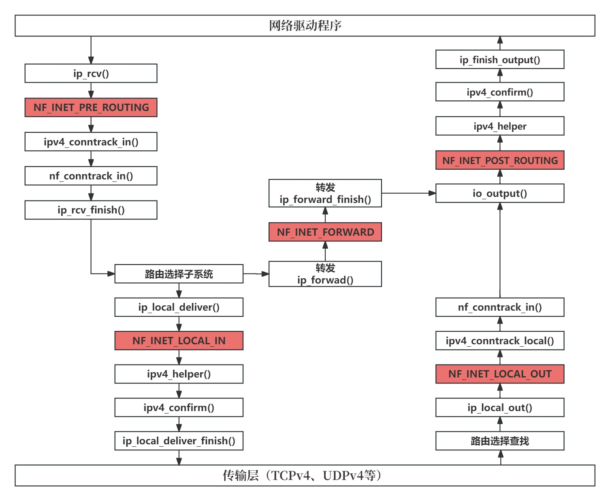
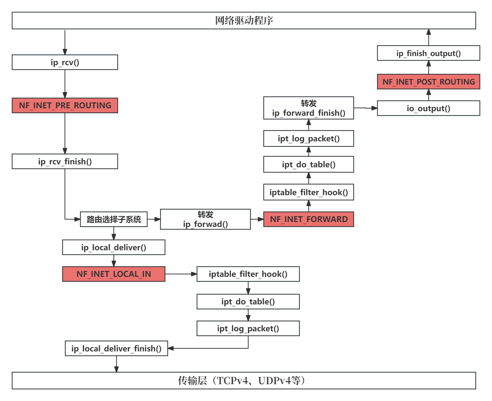

### Netfilter 详解

Netfilter 框架有最著名的Linux 内核开发人员Rusty Russell于 1998 年开发，旨在改进以前的实现 ipchains（Linux 2.2.x）和ipfwadm（Linux 2.0.x）。Netfilter 子系统提供一个框架，支持数据包在内核栈传输路径各个地方（Netfilter挂载点）注册回调函数，从而对数据包执行各种操作，如修改地址或端口，丢弃数据包、写入日志等。这些 Netfilter 挂载点为 Netfilter内核模块提供基础设施，让它能够通过注册回调函数来执行 Netfilter 子系统的各种任务。

#### 🐱‍🏍 Netfilter 挂接点

在网络协议栈中有 5 个地方设置了挂接点。注意，在 IPv4 和 IPv6中，挂接点名称相同。

***出于简化，下图不包含复杂情况，如使用 IPsec、分段或组播的情况。改图还省略了当前在主机上生成并发送数据包时调用的方法，如ip_queue_xmit() 和 ip_build_and_send_pkt()***



<center>图一、连接跟钩子回调函数</center>

***路由选择子系统负责管理和控制网络数据包的转发，它决定了数据包从源地址到目标地址的路径。主要的组成部分包括以下几个方面：路由表、路由策略、数据包转发、网络地址转换、负载均衡***

- NF_INET_PRE_ROUTING

  在 IPv4 中，该挂接点位于 ip_rcv() 中，在 IPv6 中，位于 ipv6_rcv() 中。方法 ip_rcv() 是IPv4 的协议处理程序，ipv6_rcv同理。这是所有入栈数据包遇到的第一个挂接点，处于路由选择子系统查找之前。

- NF_INET_LOCAL_IN

  在 IPv4 中，该挂接点位于 ip_local_deliver() 中，在 IPv6 中，位于 ip6_input() 中。对于所有发送给当前主机的入站数据包，经过挂接点 NF_INET_PRE_ROUTING 并执行路由选择子系统查找后，都将到达这个挂接点。

- NF_INET_FORWARD

  在 IPv4 中，该挂接点位于 ip_forward() 中，在 IPv6 中，位于 ip6_forward() 中。对于所有要转发的数据包，经过挂节点NF_INET_PRE_ROUTING并执行路由选择子系统查找后，都将到达这个挂接点。

- NF_INET_POST_ROUTING

  在 IPv4 中，该挂接点位于 ip_output() 中，在 IPv6 中，位于 ip6_finish_output2() 中。所有要转发的数据包都在经过挂载点NF_INET_FORWARD后到达这个挂接点。另外，当前主机生成的数据包经过挂接点 NF_INET_LOCAL_OUT后，都将到达这个挂咋点。

- NF_INET_LOCAL_OUT

  在 IPv4 中，该挂接点位于 __ip_local_out() 中，在 IPv6 中，位于 ip6_local_out() 中。当前主机生成的所有数据包都在经过这个挂载点后到达挂载点 NF_INET_POST_ROUTING

Netfilter 钩子回调函数的返回值必须为下述值之一（这些值被称为 netfilter verdicts，在 include/uapi/linux/netfilter.h定义）

- NF_DROP(0): 丢弃数据包 
- NF_ACCEPT(1): 数据包像通常那样，继续在内核网络栈传输 
- NF_STOLEN(2):  数据包不继续传输，由钩子方法进行处理
- NF_QUEUE(3):  将数据包排序，供用户空间使用
- NF_REPEAT(4):  再次调用钩子函数

#### 🐱‍🏍 iptables

iptables 由两部分组成：内核部分和用户空间部分。内核部分是核心。用于 IPv4 的内核部分位于 net/ipv4/netfilter/ip_tables.c中，而用于 IPv6的内核部分位于 net/ipv6/netfilter/ip6_tables.c 中。用户空间部分提供了用于访问 iptables 内核层的前端（例如，使用 iptables命令添加和删除规则）。**每个表都由 include/linux/netfilter/x_tables.h中定义的结构 x_table表示**。注册和注销表的工作分别由方法 ipt_register_table() 和 ipt_unregister_table() 完成。这些方法都是在 net/ipv4/netfilter/ip_ip6t_register_table()和ip6t_unregister_table() 完成。

网络命名空间对象包含 IPv4和IPv6专用的对象，分别是 netns_ipv4 和 netns_ipv6，而netns_ipv4和netns_ipv6又包含指向 xt_table 对象的指针。例如，netns_ipv4 包含 iptable_filter， iptable_mangle等，而结构 netns_ipv6 包含ip6table_filter、ip6table_mangle等。

为了理解 iptables的工作原理，通过一个真实的过滤表展示。出于简化，这里假设只创建了这个过滤表，另外还支持LOG目标。所用的唯一一条规则是用于日志的。

**过滤表定义：**

```c
#define FILTER_VALID_HOOKS ((1 << NF_INET_LOCAL_IN) | \
			    (1 << NF_INET_FORWARD) | \
			    (1 << NF_INET_LOCAL_OUT))


/* Furniture shopping... */
struct xt_table {
    // 用于将xt_table结构链接到一个列表中，以便内核可以轻松地遍历所有表格
	struct list_head list;

	/* 
		标识此表格适用于哪些钩子（hooks），即在哪些网络数据包处理阶段会进入这个表格。
		钩子是netfilter机制中用于插入自定义处理函数的地点
	*/
	unsigned int valid_hooks;

	/* 指向此表格的私有数据结构。__rcu表示此指针是读－复制（read-copy update）类型的，用于多线程环境下的安全访问*/
	struct xt_table_info __rcu *private;

	/* 如果此表格是由模块提供的，则设置 THIS_MODULE，否则为 NULL*/
	struct module *me;

    // 指定表格适用于哪种类型的协议族
	u_int8_t af;		/* address/protocol family */
    // 指定表格优先级
	int priority;		/* hook order */

    // 指向初始化函数的指针，用于在给定的网络命名空间（netns）中初始化此表格
	/* called when table is needed in the given netns */
	int (*table_init)(struct net *net);

	/* A unique name... */
	const char name[XT_TABLE_MAXNAMELEN];
};

static const struct xt_table packet_filter = {
	.name		= "filter",
	.valid_hooks	= FILTER_VALID_HOOKS,
	.me		= THIS_MODULE,
	.af		= NFPROTO_IPV4,
	.priority	= NF_IP_PRI_FILTER,
	.table_init	= iptable_filter_table_init,
};
```

为了初始化这个表，首先调用方法 xt_hook_link()，它将 packet_filter表的 nf_hook_ops 对象的钩子回调函数设置为方法 iptable_filter_hook()。

```c
static struct nf_hook_ops *filter_ops __read_mostly;
static int __init iptable_filter_init(void)
{
    ... ... ...
        filter_ops = xt_hook_link(&packet_filter, ioptable_filter_hook);
    ... ... ...
}
```

接下来，调用 ipt_register_table() （注意：IPv4 netns 对象 net->ipv4包含一个指向过滤表 iptable_filter的指针）。

```c
static int __net_init iptable_filter_net_init(struct net *net)
{
	... ... ...
        net->ipv4.iptable_filter = 
        	ipt_register_table(net, &packet_filter, repl);
    ... ... ...
        return PTR_RET(net->ipv4.iptable_filter);
}
```

请注意，过滤表有3个钩子：

NF_INET_LOCAL_IN / NF_INET_FORWARD / NF_INET_LOCAL_OUIT 


**1、投递到当前主机处理流程**

首先到达的是方法 ip_local_deliver()。

```c
/*
 * 	Deliver IP Packets to the higher protocol layers.
 */
int ip_local_deliver(struct sk_buff *skb)
{
	... ... ...
	return NF_HOOK(NFPROTO_IPV4, NF_INET_LOCAL_IN,
		       net, NULL, skb, skb->dev, NULL,
		       ip_local_deliver_finish);
}
```

这个方法包含钩子 NF_INET_LOCAL_IN。前面说过，NF_INET_LOCAL_IN是这个过滤表的钩子之一，因此 NF_HOOK() 宏将调用方法 iptable_filter_hook()。

```c
static unsigned int
iptable_filter_hook(void *priv, struct sk_buff *skb,
		    const struct nf_hook_state *state)
{
	return ipt_do_table(skb, state, state->net->ipv4.iptable_filter);
}
```



<center>图二、发送给当前主机的流量以及使用过滤表规则进行转发的流量</center>

方法 ipt_do_table() 实际上是通过调用 LOG 目标回调函数 ipt_log_packet()，将数据包报头写入系统日志。如果还有其他规则，也将调用相应的回调函数。由于没有其他规则，将接着执行方法 ip_local_deliver_finish()，把数据包交给传输层（L4），由相应的套接字进行处理。

2、**转发数据包**

第二种情况是，路由选择子系统查找后，发现数据包需要转发，因此调用方法 ip_forward()

```c
int ip_forward(struct sk_buff *skb)
{
	... ... ...
	return NF_HOOK(NFPROTO_IPV4, NF_INET_FORWARD,
		       net, NULL, skb, skb->dev, rt->dst.dev,
		       ip_forward_finish);
	... ... ...
}

```

前面说过，这个过滤表在挂载点 NF_INET_FORWARD 注册了钩子回调函数，因此也调用方法 iptable_filter_hook()。与前面一样，这个方法将调用方法 ipt_do_table()，后者再调用方法 ipt_log_packet()。接下来，将调用方法 ip_forward_finish()（注意：前面调用 NF_HOOK宏时，最后一个参数为 ip_forward_finish，它表示接下来要调用的方法）。然后，调用 ip_output()。由于这个过滤表没有钩子 NF_INET_POST_ROUTING，因此接着执行方法 ip_finish_output()。
