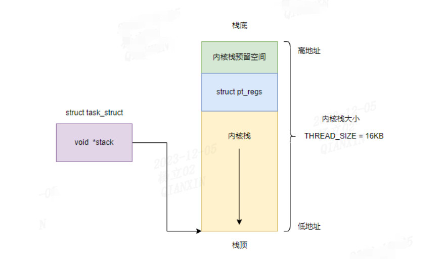
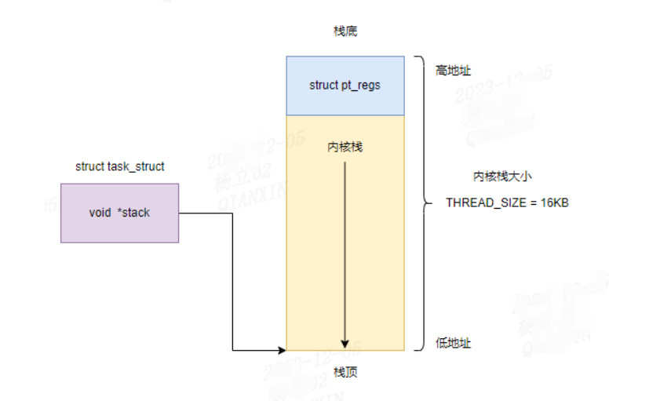

## Linux 进程管理之内核栈和struct pt_regs
### 前言
Linux内核栈是用于存储内核执行期间的函数调用和临时数据的一块内存区域。每个运行的进程都有自己的内核栈，用于处理中断、异常、系统调用以及内核函数的执行。

**进程的内核栈**：在Linux中，每个进程都有自己的内核栈。当进程从用户空间切换到内核空间时，它将使用自己的内核栈来执行内核代码。

**栈空间分配**：内核栈在进程创建时被分配和初始化。在进程切换时，内核会自动切换到相应进程的内核栈。

**大小限制**：Linux内核栈的大小通常是固定的，取决于架构和编译时的配置。它通常较小，以节省内存空间。

**栈溢出**：由于内核栈的大小有限，如果在内核执行期间使用过多的栈空间，会导致栈溢出。栈溢出可能会导致系统崩溃或不可预测的行为。因此，内核开发人员需要注意避免在内核代码中使用过多的栈空间。

**中断和上下文切换**：当发生中断或系统调用时，当前进程的上下文会被保存到其内核栈中，然后切换到内核中断处理程序或系统调用处理程序的上下文。完成处理后，内核将恢复进程的上下文，并继续执行原来的任务。

### 一、内核栈
linux程序通过系统调用、中断、异常等手段从用户态切换到内核态时，内核中会有各种各样的函数调用：

对于x86_64架构函数调用，前六个参数使用rdi、rsi、rdx、rcx、r8、r9 这 6 个寄存器，用于传递存储函数调用时的 6 个参数。如果超过 6 的时候，需要放到栈里面。然而，前 6 个参数有时候需要进行寻址，但是如果在寄存器里面，是没有地址的，因而还是会放到栈里面，只不过放到栈里面的操作是被调用函数做的。

这样就需要栈来保存函数调用过程的局部变量，函数参数等，这些局部变量，函数参数就是保存在进程的内核栈中 `struct task_struct -> stack`。

```c
struct task_struct {
	......
	void				*stack;
	......
}

/*Linux 给每个 task 都分配了内核栈，内核栈大小 THREAD_SIZE为 */
union thread_union {
	......
	unsigned long stack[THREAD_SIZE/sizeof(long)];
};
```

当没有配置`CONFIG_KASAN`选项，`KASAN_STACK_ORDER = 0`，在 `PAGE_SIZE` 的基础上左移两位，那么内核栈的大小就是4个页面的大小：4 * 4096，即 16 KB.
```c
// linux-6.2\arch\x86\include\asm\page_types.h
/* PAGE_SHIFT determines the page size */
#define PAGE_SHIFT		12

// linux-6.2\arch\x86\include\asm\page_64_types.h
#ifdef CONFIG_KASAN
#define KASAN_STACK_ORDER 1
#else
#define KASAN_STACK_ORDER 0
#endif

#define THREAD_SIZE_ORDER	(2 + KASAN_STACK_ORDER)
#define THREAD_SIZE  (PAGE_SIZE << THREAD_SIZE_ORDER)
```

**内核栈结构**



在内核栈的最高地址端，存放的是另一个结构 pt_regs，这个结构体保存着进程从应用层进入到内核层时，用户态寄存器的状态。

我们可以看到在结构 pt_regs上面还有一个内核栈预留空间，这在x86_32位架构是一个遗留问题，在x86_64架构和arm64架构都没有该内核栈预留空间，因此：



**获取内核栈**

`task_stack_page` 函数用于获取任务的栈页指针，`end_of_stack` 函数用于获取栈的末尾地址。
```c
/*
 * When accessing the stack of a non-current task that might exit, use
 * try_get_task_stack() instead.  task_stack_page will return a pointer
 * that could get freed out from under you.
 */
static inline void *task_stack_page(const struct task_struct *task)
{
	return task->stack;
}

#define setup_thread_stack(new,old)	do { } while(0)

static inline unsigned long *end_of_stack(const struct task_struct *task)
{
	return task->stack;
}
```

**获取 pr_regs 结构体**

内核通过 task_pt_regs 宏根据一个task来获取该task的struct pt_regs
```c
// 由于 x86_64内核栈的预留空间为 0, 所以 TOP_OF_KERNEL_STACK_PADDING 为 0
#define task_pt_regs(task) \
({									\
	unsigned long __ptr = (unsigned long)task_stack_page(task);	\
	__ptr += THREAD_SIZE - TOP_OF_KERNEL_STACK_PADDING;		\
	((struct pt_regs *)__ptr) - 1;					\
})
```

### 二、struct pt_regs 简介
linux程序通过系统调用、中断、异常等手段从用户态切换到内核态时，内核态需要保存用户态的寄存器上下文，通常内核态会在内核态堆栈的最顶端保留一段空间来存储用户态的寄存器上下文，这段空间的存储格式为pt_regs，当进程用内核态切换到用户态时，就会获取pt_regs结构体中的成员，这样就可以获取当进程用户态运行的寄存器上下文状态了。

当系统调用从用户态到内核态的时候，首先要做的第一件事情，就是将用户态运行过程中的 CPU 上下文保存起来，其实主要就是保存在这个结构的寄存器变量里。这样当从内核系统调用返回的时候，才能让进程在刚才的地方接着运行下去。

#### x86 struct pt_regs 解析
```c
struct pt_regs {
/*
 * C ABI says these regs are callee-preserved. They aren't saved on kernel entry
 * unless syscall needs a complete, fully filled "struct pt_regs".
 */
	unsigned long r15;
	unsigned long r14;
	unsigned long r13;
	unsigned long r12;
	unsigned long rbp;
	unsigned long rbx;
/* These regs are callee-clobbered. Always saved on kernel entry. */
	unsigned long r11;
	unsigned long r10;
	unsigned long r9;
	unsigned long r8;
	unsigned long rax;
	unsigned long rcx;
	unsigned long rdx;
	unsigned long rsi;
	unsigned long rdi;
/*
 * On syscall entry, this is syscall#. On CPU exception, this is error code.
 * On hw interrupt, it's IRQ number:
 */
	unsigned long orig_rax;
/* Return frame for iretq */
	unsigned long rip;
	unsigned long cs;
	unsigned long eflags;
	unsigned long rsp;
	unsigned long ss;
/* top of stack page */
};
```

#### 解析
```c
/*
    C ABI 规定这些寄存器由被调用者保留。除非系统调用需要一个完整、完全填充的 'struct pt_regs'，否则它们在内核进入时不会被保存。
*/
unsigned long r15;
unsigned long r14;
unsigned long r13;
unsigned long r12;
unsigned long rbp;
unsigned long rbx;
```
- RBP：基址指针寄存器，通常用于建立栈帧以及访问栈中的局部变量。
- RBX：基址寄存器，通常被用作通用寄存器。
- R12-R15：通用寄存器，可以用于存储任意数据。

RBX、R12-R15：通用寄存器，用于保存被调用函数需要保留的寄存器值。在函数调用过程中，被调用函数可以使用这些寄存器而不必担心它们的值会被修改。

```c
/*
    这些寄存器是被调用者破坏的。在内核进入时始终会保存。
*/
unsigned long r11;
unsigned long r10;
unsigned long r9;
unsigned long r8;
unsigned long rax;
unsigned long rcx;
unsigned long rdx;
unsigned long rsi;
unsigned long rdi;
```
- R11：用于存储系统调用号或者信号处理时的标志。
- R8-R10：通用寄存器，可以用于存储任意数据。
- RAX：累加器寄存器，用于存储函数返回值、算术运算结果和I/O操作。
- RCX：计数器寄存器，在循环和字符串操作中经常用到。
- RDX：数据寄存器，通常用于存放I/O端口地址和一些乘法或除法的操作参数。
- RSI：源索引寄存器，通常作为源操作数的指针。
- RDI：目的索引寄存器，通常作为目的操作数的指针。

RCX、RDX、RSI、RDI、R8-R9：用于传递函数的参数。前六个整型参数（64位）依次存储在RCX、RDX、RSI、RDI、R8和R9寄存器中

```c
/*
    在系统调用进入时，这是系统调用号。在CPU异常中，这是错误代码。
    在硬件中断中，它是中断请求（IRQ）号
*/
unsigned long orig_rax;
```
- ORIG_RAX: 在系统调用进入时，该字段保存系统调用号；在CPU异常时，保存错误代码；在硬件中断时，保存中断请求号。

```c
/*
    保存中断或异常处理程序的上下文信息
*/
unsigned long rip;
unsigned long cs;
unsigned long eflags;
unsigned long rsp;
unsigned long ss;
```

### 参考
极客时间：趣谈操作系统