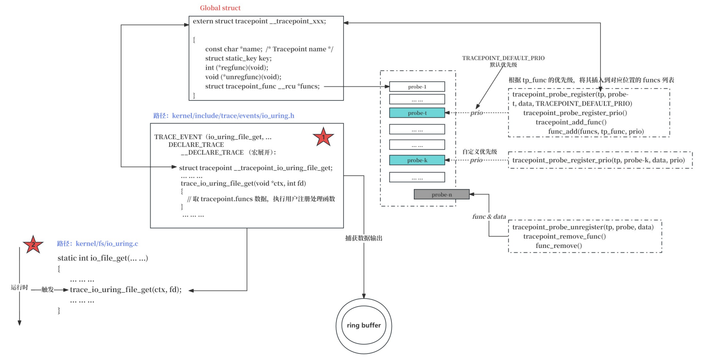

## TRACEPOINT 原理与实现

***基于 4.19 内核进行解析***

Tracepoints是Linux内核中的一种跟踪机制，最早由Red Hat的Ingo Molnár提出并实现。它的主要目的是为了帮助开发者在内核中添加轻量级的跟踪点，以便在运行时收集性能数据、调试信息等，而无需停机或重新编译内核。

首先介绍 TracePoint 中的重要宏函数 TRACE_EVENT，继而串联整个TracePoint架构和实现。

### 🍖TRACE_EVENT 

为了解决自动跟踪点的问题，TRACE_EVENT（）宏应运而生，该宏专门用于允许开发人员向其子系统添加跟踪点，并使Ftrace能够自动跟踪它们。开发人员不需要了解Ftrace的工作原理，他们只需要使用TRACE_EVENT（）宏创建跟踪点。此外，他们需要遵循一些指南来创建头文件，这样他们就可以完全访问Ftrace跟踪程序。TRACE_EVENT（）宏设计的另一个目的是不将其耦合到Ftrace或任何其他跟踪器。

***ftrace / perf / systemtap / ebpf / LTTng 等都使用了 TRACE_EVENT（）***

#### ① TRACE_EVENT组件

自动跟踪点必须满足以下各种要求：

（1）必须创建一个可以放置在内核代码中的跟踪点。
（2）必须创建一个可以挂接到该跟踪点的回调函数。
（3）回调函数必须能够以最快的方式将传递给它的数据记录到跟踪环缓冲区中。
（4）必须创建一个函数，该函数可以解析记录到环形缓冲区中的数据，并将其转换为跟踪程序可以向用户显示的人类可读格式。

为满足以上要求，TRACE_EVENT（）宏被分为六个组件，它们对应于宏的参数如下：

```c
#define TRACE_EVENT(name, proto, args, struct, assign, print)	\
	DECLARE_TRACE(name, PARAMS(proto), PARAMS(args))
```

- name: 要创建的跟踪点名称
- prototype: 跟踪点回调函数的原型
- args: 和原型匹配的参数
- struct: 描述了跟踪点采集到的数据保存在环形缓冲区的结构布局
- assign: 将跟踪点捕获的数据保存到环形缓冲区
- print：打印数据的格式化

#### ② TRACE_EVENT 示例  <trace_sched_switch> 

```c
// linux-5.10\include\trace\events\sched.h

/*
 * Tracepoint for task switches, performed by the scheduler:
 */
TRACE_EVENT(sched_switch,

	TP_PROTO(bool preempt,
		 struct task_struct *prev,
		 struct task_struct *next),

	TP_ARGS(preempt, prev, next),

	TP_STRUCT__entry(
		__array(	char,	prev_comm,	TASK_COMM_LEN	)
		__field(	pid_t,	prev_pid			)
		__field(	int,	prev_prio			)
		__field(	long,	prev_state			)
		__array(	char,	next_comm,	TASK_COMM_LEN	)
		__field(	pid_t,	next_pid			)
		__field(	int,	next_prio			)
	),

	TP_fast_assign(
		memcpy(__entry->next_comm, next->comm, TASK_COMM_LEN);
		__entry->prev_pid	= prev->pid;
		__entry->prev_prio	= prev->prio;
		__entry->prev_state	= __trace_sched_switch_state(preempt, prev);
		memcpy(__entry->prev_comm, prev->comm, TASK_COMM_LEN);
		__entry->next_pid	= next->pid;
		__entry->next_prio	= next->prio;
		/* XXX SCHED_DEADLINE */
	),

	TP_printk("prev_comm=%s prev_pid=%d prev_prio=%d prev_state=%s%s ==> next_comm=%s next_pid=%d next_prio=%d",
		__entry->prev_comm, __entry->prev_pid, __entry->prev_prio,

		(__entry->prev_state & (TASK_REPORT_MAX - 1)) ?
		  __print_flags(__entry->prev_state & (TASK_REPORT_MAX - 1), "|",
				{ TASK_INTERRUPTIBLE, "S" },
				{ TASK_UNINTERRUPTIBLE, "D" },
				{ __TASK_STOPPED, "T" },
				{ __TASK_TRACED, "t" },
				{ EXIT_DEAD, "X" },
				{ EXIT_ZOMBIE, "Z" },
				{ TASK_PARKED, "P" },
				{ TASK_DEAD, "I" }) :
		  "R",

		__entry->prev_state & TASK_REPORT_MAX ? "+" : "",
		__entry->next_comm, __entry->next_pid, __entry->next_prio)
);

```

除第一个参数外的所有参数都用另一个宏（TP_PROTO、TP_ARGS、TP_STRUCT__entry、TP_fast_assign 和 TP_printk）封装。这些宏提供了更多的处理控制，并且允许在TRACE_EVENT（）宏中使用逗号。

让我们来看看 *TRACE_EVENT(name, proto, args, struct, assign, print)* 中每个参数的宏封装

**Name**

用于调用此跟踪点的名称，实际使用的跟踪点在名称前加上 `trace_` 前缀 （即：trace_sched_swith）

```c 
TRACE_EVENT(sched_switch,
```

```c
#define CREATE_TRACE_POINTS
#include <trace/events/sched.h>
#undef CREATE_TRACE_POINTS

static void __sched notrace __schedule(bool preempt)
{
    ... ...
    trace_sched_switch(preempt, prev, next); // (跟踪点)使用 tracepoint: sched_switch
    ... ...
}
```

**Prototype**

用于声明一个跟踪点（tracepoint）的函数原型（prototype）（**即**函数声明给出的函数名、返回值类型、参数列表（重点是参数类型）等与该函数有关的信息，告诉编译器与该函数有关的信息，感知函数存在）。

```c
TP_PROTO(bool preempt,
         struct task_struct *prev,
         struct task_struct *next),
```

```c
trace_sched_switch(bool preempt, struct task_struct *prev, struct task_struct *next)
```

**Arguments**

保存函数原型使用的参数，该数据将用于  TRACE_EVENT 宏逐层展开后的回调函数的参数。

DEFINE_EVENT -> \_\_DECLARE_TRACE -> trace\_\__##name()/register_trace_##name()

```c
#define __DECLARE_TRACE(name, proto, args, cond, data_proto, data_args) \
    ... ... 
    static inline void trace_##name(proto)				\
    ...	...
    __DECLARE_TRACE_RCU(name, PARAMS(proto), PARAMS(args),		\
    ... ...
```

**Structure**

描述了跟踪点采集到的数据保存在环形缓冲区的结构布局

```c
TP_STRUCT__entry(
		__array(	char,	prev_comm,	TASK_COMM_LEN	)
		__field(	pid_t,	prev_pid			)
		__field(	int,	prev_prio			)
		__field(	long,	prev_state			)
		__array(	char,	next_comm,	TASK_COMM_LEN	)
		__field(	pid_t,	next_pid			)
		__field(	int,	next_prio			)
	),
```

\_\_array(_type, _item, _len)：定义一个数组项，相当于 char prev_comm[TASK_COMM_LEN]

__field(type, item)：定义普通变量，相当于  pid_t prev_pid 

上述宏展开后完整的数据结构如下：

```c
struct {
   char   prev_comm[TASK_COMM_LEN];
   pid_t  prev_pid;
   int    prev_prio;
   long   prev_state;
   char   next_comm[TASK_COMM_LEN];
   pid_t  next_pid;
   int    next_prio;
};
```

**Assignment**

将跟踪点捕获的数据保存到环形缓冲区

```c
TP_fast_assign(
    memcpy(__entry->next_comm, next->comm, TASK_COMM_LEN);
    __entry->prev_pid	= prev->pid;
    __entry->prev_prio	= prev->prio;
    __entry->prev_state	= __trace_sched_switch_state(preempt, prev);
    memcpy(__entry->prev_comm, prev->comm, TASK_COMM_LEN);
    __entry->next_pid	= next->pid;
    __entry->next_prio	= next->prio;
    /* XXX SCHED_DEADLINE */
),
```

TP_fast_assign 是正常 C 代码。\_\_entry 为指向 TP_STRUCT\_\_entry 的结构体指针，并且直接指向环形缓冲区。TP_fast_assign 的功能是填充 TP_STRUCT_entry 中创建的所有字段，使用 TP_PROTO 和 TP_ARGS 将适当的数据分配到 \_\_entry 结构中。

**Print**

定义如何使用 printk() 打印 TP_STRUCT_entry 结构体中的字段，打印格式。\_\_print_flags() 是 TRACE_EVENT() 附带的一组帮助函数的一部分。

```c
TP_printk("prev_comm=%s prev_pid=%d prev_prio=%d prev_state=%s%s ==> next_comm=%s next_pid=%d next_prio=%d",
		__entry->prev_comm, __entry->prev_pid, __entry->prev_prio,

		(__entry->prev_state & (TASK_REPORT_MAX - 1)) ?
		  __print_flags(__entry->prev_state & (TASK_REPORT_MAX - 1), "|",
				{ TASK_INTERRUPTIBLE, "S" },
				{ TASK_UNINTERRUPTIBLE, "D" },
				{ __TASK_STOPPED, "T" },
				{ __TASK_TRACED, "t" },
				{ EXIT_DEAD, "X" },
				{ EXIT_ZOMBIE, "Z" },
				{ TASK_PARKED, "P" },
				{ TASK_DEAD, "I" }) :
		  "R",

		__entry->prev_state & TASK_REPORT_MAX ? "+" : "",
		__entry->next_comm, __entry->next_pid, __entry->next_prio)
```

#### ③ TRACE_EVENT 宏展开

```c
TRACE_EVENT(io_uring_file_get,

        TP_PROTO(void *ctx, int fd),

        TP_ARGS(ctx, fd),

        TP_STRUCT__entry (
                __field(  void *,       ctx     )
                __field(  int,          fd      )
        ),

        TP_fast_assign(
                __entry->ctx    = ctx;
                __entry->fd             = fd;
        ),

        TP_printk("ring %p, fd %d", __entry->ctx, __entry->fd)
);
```

**展开后结果**

TRACE_EVENT -> DECLARE_TRACE -> __DECLARE_TRACE 

```c
extern struct tracepoint __tracepoint_io_uring_file_get;

static inline void trace_io_uring_file_get(void *ctx, int fd)
{
    // key 为 false 则执行代码块。 https://abcdxyzk.github.io/blog/2020/09/21/kernel-static-key/
	if (static_key_false(&__tracepoint_io_uring_file_get.key))
		do {
			struct tracepoint_func *it_func_ptr;
			void *it_func;
			void *__data;
            // __maybe_unused 告诉编译器，该变量可能未使用
			int __maybe_unused idx = 0;	
            
			// 当前CPU是否在线
			if (!(cpu_online(raw_smp_processor_id()))
				return;

			/* keep srcu and sched-rcu usage consistent */
            // 禁用抢占（preemption）并且不跟踪调用栈
			preempt_disable_notrace();
			
            // 从__tracepoint_io_uring_file_get中获取 probe 函数列表
			it_func_ptr = rcu_dereference_raw((__tracepoint_io_uring_file_get)->funcs);

			if (it_func_ptr) {
				do {
					it_func = (it_func_ptr)->func;
					__data = (it_func_ptr)->data;
                    // 调用用户注册的 probe 函数指针
					((void(*)(void *__data, void *ctx, int fd))(it_func))(__data, ctx, fd);	
				} while ((++it_func_ptr)->func);
			}
			
			preempt_enable_notrace();
		} while (0)
                
	// CONFIG_LOCKDEP 进行锁的依赖性分析，开启后会在运行时跟踪所有获取和释放的锁，记录它们依赖关系
	if (IS_ENABLED(CONFIG_LOCKDEP) && (cpu_online(raw_smp_processor_id())) {
		rcu_read_lock_sched_notrace();
		rcu_dereference_sched(__tracepoint_io_uring_file_get.funcs);
		rcu_read_unlock_sched_notrace();
	}
}

#ifndef MODULE
static inline void trace_io_uring_file_get_rcuidle(void *ctx, int fd)
{
	if (static_key_false(&__tracepoint_io_uring_file_get.key))
		do {
			struct tracepoint_func *it_func_ptr;
			void *it_func;
			void *__data;
			int __maybe_unused idx = 0;	

			if (!(cpu_online(raw_smp_processor_id()))
				return;
				
			/* srcu can't be used from NMI */
			WARN_ON_ONCE(1 && in_nmi());

			/* keep srcu and sched-rcu usage consistent */
			preempt_disable_notrace();
			
			/*
			 * For rcuidle callers, use srcu since sched-rcu
			 * doesn't work from the idle path.
			 */
			if (1) {
                // 调用 SRCU 锁，用于读者数量比较少情况，提供更低延迟
				idx = srcu_read_lock_notrace(&tracepoint_srcu);
                // 保存当前中断状态并禁用所有中断，通知当前CPU从空闲状态进入到中断处理
				rcu_irq_enter_irqson();
			}

			it_func_ptr = rcu_dereference_raw((__tracepoint_io_uring_file_get)->funcs);

			if (it_func_ptr) {
				do {
					it_func = (it_func_ptr)->func;
					__data = (it_func_ptr)->data;
					((void(*)(void *__data, void *ctx, int fd))(it_func))(__data, ctx, fd);	
				} while ((++it_func_ptr)->func);
			}
			
			if (1) {
				rcu_irq_exit_irqson();
				srcu_read_unlock_notrace(&tracepoint_srcu, idx);
			}
			
			preempt_enable_notrace();
		} while (0)
}
#else
#define __DECLARE_TRACE_RCU(name, proto, args, cond, data_proto, data_args)
#endif

/*
	将 probe - 用户定义回调函数， data - 传递额外的数据到探测点。probe 和 data 将被封装到 tracepoint_func 中，
	然后插入到 __tracepoint_io_uring_file_get.funcs 链表中
*/
static inline int						
register_trace_io_uring_file_get(void (*probe)(void *__data, void *ctx, int fd), void *data)	
{								
	return tracepoint_probe_register(&__tracepoint_io_uring_file_get,	
					(void *)probe, data);	
}

/*
	基础功能和 register 相同，增加了对 probe 优先级的指定，优先级越高在 funcs 链表位置越靠前
*/
static inline int						
register_trace_prio_io_uring_file_get(void (*probe)(void *__data, void *ctx, int fd), void *data,
			   int prio)				
{								
	return tracepoint_probe_register_prio(&__tracepoint_io_uring_file_get, 
					  (void *)probe, data, prio); 
}

/*
	将 probe 从 funcs 链表中卸掉
*/
static inline int						
unregister_trace_io_uring_file_get(void (*probe)(void *__data, void *ctx, int fd), void *data)	
{								
	return tracepoint_probe_unregister(&__tracepoint_io_uring_file_get,
					(void *)probe, data);	
}
                
static inline void						
check_trace_callback_type_io_uring_file_get(void (*cb)(void *__data, void *ctx, int fd))	
{								
}			

/*
	检查该 hook 点是否激活
*/ 
static inline bool						
trace_io_uring_file_get_enabled(void)					
{								
	return static_key_false(&__tracepoint_io_uring_file_get.key);	
}
```

### 🍖TRACEPOINT 架构与实现



**tracepoint 结构体成员解读：**

- name:  tracepoint 的名称，通常用于标识和区分不同的 tracepoint
- static_key: 判断 tracepoint 是否被激活（也就是是否有函数关联到该 tracepoint）的关键字段
- void (\*regfunc)(void) 和 void (\*unregfunc)(void) : 函数指针，用于在注册和注销阶段执行用户定义功能
- tracepoint_func：指向一组与该 tracepoint 关联的函数列表的指针， 执行流到达该 hook 点，依次调用这些函数处理

**probe 注入流程代码解读**

```c
int tracepoint_probe_register(struct tracepoint *tp, void *probe, void *data)
{
    // TRACEPOINT_DEFAULT_PRIO 为默认优先级
	return tracepoint_probe_register_prio(tp, probe, data, TRACEPOINT_DEFAULT_PRIO);
}
EXPORT_SYMBOL_GPL(tracepoint_probe_register);
```

```c
// 填充 tracepoint_func 成员，并执行 tracepoint_add_func 处理函数
int tracepoint_probe_register_prio(struct tracepoint *tp, void *probe,
				   void *data, int prio)
{
	struct tracepoint_func tp_func;
	int ret;

	mutex_lock(&tracepoints_mutex);
	tp_func.func = probe;
	tp_func.data = data;
	tp_func.prio = prio;
	ret = tracepoint_add_func(tp, &tp_func, prio);
	mutex_unlock(&tracepoints_mutex);
	return ret;
}
EXPORT_SYMBOL_GPL(tracepoint_probe_register_prio);
```

```c
// 根据 probe 优先级，添加 probe 到 tracepoint 中
static int tracepoint_add_func(struct tracepoint *tp,
			       struct tracepoint_func *func, int prio)
{
	struct tracepoint_func *old, *tp_funcs;
	int ret;

    /*
    	tp->regfunc: 用户是否添加注册前操作
    	static_key_enabled: 判断是否为第一次注册
    */
	if (tp->regfunc && !static_key_enabled(&tp->key)) {
        // 执行注册阶段用户自定义处理，此处可以用于执行过滤操作等
		ret = tp->regfunc();
		if (ret < 0)
			return ret;
	}
    
	// 获取用户注册的 probes 函数指针链表
	tp_funcs = rcu_dereference_protected(tp->funcs,
			lockdep_is_held(&tracepoints_mutex));
    // 按照 prio 优先级，将 func 插入到链表的对应位置，优先级越高越靠前
	old = func_add(&tp_funcs, func, prio);
	if (IS_ERR(old)) {
		WARN_ON_ONCE(PTR_ERR(old) != -ENOMEM);
		return PTR_ERR(old);
	}

	/*
	 * rcu_assign_pointer has as smp_store_release() which makes sure
	 * that the new probe callbacks array is consistent before setting
	 * a pointer to it.  This array is referenced by __DO_TRACE from
	 * include/linux/tracepoint.h using rcu_dereference_sched().
	 */
    /*
		 RCU 是一种允许读者和写者并发执行的机制。当我们需要更新 tracepoint 的回调函数列表时，可以先准备一个新列表，
		 然后通过 RCU 更新指向这个列表的全局指针。而读者（执行 tracepoint 的地方）则可以继续使用旧列表直到看到全局
		 指针变化。由于 RCU 的设计保证了内存和执行顺序的正确性，所以这样做能够无锁并发地完成更新操作，从而提高性能。
    */
	rcu_assign_pointer(tp->funcs, tp_funcs);
    
    // static_key_enabled 函数用于 tp->key 类型检查和 tp->key 的引用计数，返回引用计数是否大于0的判断结果
	if (!static_key_enabled(&tp->key))
        // 增加 tp->key 的引用计数
		static_key_slow_inc(&tp->key);
	release_probes(old);
	return 0;
}
```

**probe 卸载流程代码解读**

```c
int tracepoint_probe_unregister(struct tracepoint *tp, void *probe, void *data)
{
	struct tracepoint_func tp_func;
	int ret;

	mutex_lock(&tracepoints_mutex);
	tp_func.func = probe;
	tp_func.data = data;
	ret = tracepoint_remove_func(tp, &tp_func);
	mutex_unlock(&tracepoints_mutex);
	return ret;
}
EXPORT_SYMBOL_GPL(tracepoint_probe_unregister);
```

```c
static int tracepoint_remove_func(struct tracepoint *tp,
		struct tracepoint_func *func)
{
	struct tracepoint_func *old, *tp_funcs;

	tp_funcs = rcu_dereference_protected(tp->funcs,
			lockdep_is_held(&tracepoints_mutex));
    /*
    	支持针对多个 probe 的批量卸载操作；
    	首先遍历匹配需要卸载的 probe 个数，
    	针对全部卸载和部分卸载分别进行处理。
    */
	old = func_remove(&tp_funcs, func);
	if (IS_ERR(old)) {
		WARN_ON_ONCE(PTR_ERR(old) != -ENOMEM);
		return PTR_ERR(old);
	}

	if (!tp_funcs) {
		/* Removed last function */
		if (tp->unregfunc && static_key_enabled(&tp->key))
            // 执行用户定义的卸载后操作，可用于信息打印等
			tp->unregfunc();

        // 将 tp->key 的引用置零
		if (static_key_enabled(&tp->key))
			static_key_slow_dec(&tp->key);
	}
	rcu_assign_pointer(tp->funcs, tp_funcs);
	release_probes(old);
	return 0;
}
```

