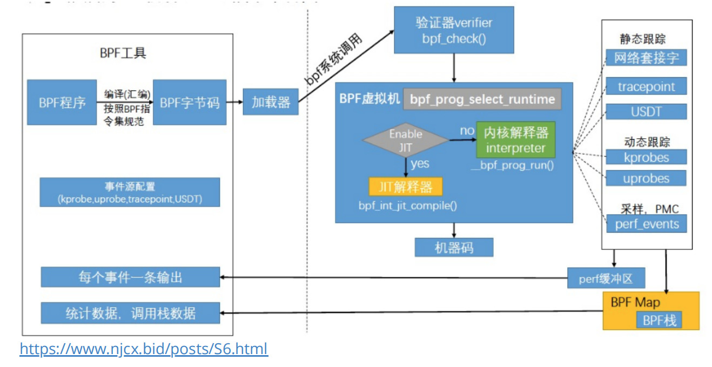
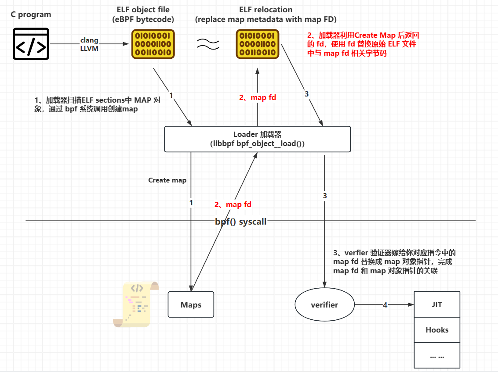

## 梳理 eBPF 模块在 Verfier 与 Jit 阶段的主要流程

> 内核版本 kernel 5.10 



**verfier:  ** eBPF的一个验证器，实现了一个本模块下的CFI/CFG（控制流完整性）机制。
**jit: ** Just-In-Time，即时编译，eBPF汇编会在内核中被规则替换成真正的x64的指令。

### 一、**前置知识**

eBPF 是一个 RISC 寄存器机，共有[ 11 个 64 位寄存器](https://github.com/torvalds/linux/blob/v4.20/include/uapi/linux/bpf.h#L45)，涉及一个程序计数器和 512 字节的固定大小的栈。9 个寄存器是通用读写的，1 个是只读栈指针，程序计数器是隐式的，也就是说，我们只能跳转到它的某个偏移量。VM 寄存器总是 64 位宽（即使在 32 位 ARM 处理器内核中运行！），如果最重要的 32 位被清零，则支持 32 位子寄存器寻址 - 在交叉编译和在嵌入式设备上运行 eBPF 程序时非常有用。

| 寄存器       | 功能                                                         |
| :----------- | :----------------------------------------------------------- |
| **`r0:`**    | 存储返回值，包括函数调用和当前程序退出代码                   |
| **`r1-r5:`** | 作为函数调用参数使用，在程序启动时，r1 包含 "上下文" 参数指针 |
| **`r6-r9:`** | 这些在内核函数调用之间被保留下来，callee 保存（提供 ebpf prog 安全使用寄存器） |
| **`r10:`**   | 每个 eBPF 程序 512 字节栈的只读指针                          |

所有 eBPF 汇编在内核中定义为一个 `struct bpf_insn` ，当我们需要写的时候一般将连续的指令布置成一个结构体数组：

```c
struct bpf_insn {
	__u8	code;		/* opcode */
	__u8	dst_reg:4;	/* dest register */
	__u8	src_reg:4;	/* source register */
	__s16	off;		/* signed offset */
	__s32	imm;		/* signed immediate constant */
};

msb                                                        lsb
+------------------------+----------------+----+----+--------+
|immediate               |offset          |src |dst |opcode  |
+------------------------+----------------+----+----+--------+

struct bpf_insn insn[] = {
    BPF_LD_MAP_FD(BPF_REG_1,3),
      ......
 
};
```

具体使用操作如下：

```c
/*
	用户态定义辅助函数
*/
static int bpf_prog_load(enum bpf_prog_type prog_type,
        const struct bpf_insn *insns, int prog_len,
        const char *license, int kern_version){
 
    union bpf_attr attr = {
        .prog_type = prog_type,
        .insns = (uint64_t)insns,
        .insn_cnt = prog_len / sizeof(struct bpf_insn),
        .license = (uint64_t)license,
        .log_buf = (uint64_t)bpf_log_buf,
        .log_size = LOG_BUF_SIZE,
        .log_level = 1,
    };
    attr.kern_version = kern_version;
    bpf_log_buf[0] = 0;
    return syscall(__NR_bpf, BPF_PROG_LOAD, &attr, sizeof(attr));
}

/*
	内核态对应的处理函数
*/
case BPF_PROG_LOAD:
    err = bpf_prog_load(&attr, uattr);
    break;

/*
	内核态 struct bpf_prog 结构体用于维护一个内核中的 eBPF 程序
*/
struct bpf_prog {
    u16            pages;        /* Number of allocated pages */
    u16            jited:1,    /* Is our filter JIT'ed? */
                jit_requested:1,/* archs need to JIT the prog */
                gpl_compatible:1, /* Is filter GPL compatible? */
                cb_access:1,    /* Is control block accessed? */
                dst_needed:1,    /* Do we need dst entry? */
                blinded:1,    /* Was blinded */
                is_func:1,    /* program is a bpf function */
                kprobe_override:1, /* Do we override a kprobe? */
                has_callchain_buf:1, /* callchain buffer allocated? */
                enforce_expected_attach_type:1; /* Enforce expected_attach_type checking at attach time */
    enum bpf_prog_type    type;        /* Type of BPF program */
    enum bpf_attach_type    expected_attach_type; /* For some prog types */
    u32            len;        /* Number of filter blocks */
    u32            jited_len;    /* Size of jited insns in bytes */
    u8            tag[BPF_TAG_SIZE];
    struct bpf_prog_aux    *aux;        /* Auxiliary fields */
    struct sock_fprog_kern    *orig_prog;    /* Original BPF program */
    unsigned int        (*bpf_func)(const void *ctx,
                        const struct bpf_insn *insn);
    /* Instructions for interpreter */
    union {
        struct sock_filter    insns[0];
        struct bpf_insn        insnsi[0];
    };
};
```

### **二、bpf_prog_load 功能解析**

1. 首先有一系列的检查。（这部分我贴上来的代码中才剪掉了，主要涉及一些权限和标识）
2. 通过 `bpf_prog_alloc(bpf_prog_size(attr->insn_cnt), GFP_USER)` 为我们的`prog`分配空间，分配大小为`struct bpf_prog`加指令长度。返回一个 `struct bpf_prog *`
3. 检测`LSM hook`: `security_bpf_prog_alloc(prog->aux)`。
4. 将程序长度赋值为指令长度：`prog->len = attr->insn_cnt;`
5. 将用户态的`insn`拷贝到内核态分配的空间: `copy_from_user`。
6. 通过`prog`的类型赋值 `ops` 虚表，里面定义了对应的绑定好的函数。
7. 调用`verifier`检测控制流完整性等。（这一部分也很重要，但是本篇文章主要重点放在`jit`编译阶段）
8. **单bpf函数调用 `bpf_prog_select_runtime(prog,&err)` jit 编译 prog。多 bpf 函数的 prog 调用 jit_subprog。两者都会统一到针对 do_jit 的调用。**
9. 为编译后的`prog`分配一个唯一的`id`，`bpftools`会用到这个`id`。

```c
static int bpf_prog_load(union bpf_attr *attr, union bpf_attr __user *uattr)
{
	enum bpf_prog_type type = attr->prog_type;
	struct bpf_prog *prog;
	int err;
	char license[128];
	bool is_gpl;

	... 1 ...
       	进行一系列的检查
	
	... 2 ...
        
	/* plain bpf_prog allocation */
	prog = bpf_prog_alloc(bpf_prog_size(attr->insn_cnt), GFP_USER);
	if (!prog)
		return -ENOMEM;
    
	... 3 ...

	err = security_bpf_prog_alloc(prog->aux);
	if (err)
		goto free_prog_nouncharge;

	... 4 / 5 ...
    prog->len = attr->insn_cnt;

	err = -EFAULT;
	if (copy_from_user(prog->insns, u64_to_user_ptr(attr->insns),
			   bpf_prog_insn_size(prog)) != 0)
		goto free_prog;
    
    ... 6 ...

	/* find program type: socket_filter vs tracing_filter */
	err = find_prog_type(type, prog);
	if (err < 0)
		goto free_prog;

	prog->aux->load_time = ktime_get_boottime_ns();
	err = bpf_obj_name_cpy(prog->aux->name, attr->prog_name,
			       sizeof(attr->prog_name));
	if (err < 0)
		goto free_prog;
	
    ... 7 / 8 / 9 ...
	/* run eBPF verifier */
	err = bpf_check(&prog, attr, uattr);
	if (err < 0)
		goto free_used_maps;

	prog = bpf_prog_select_runtime(prog, &err);
	if (err < 0)
		goto free_used_maps;

	err = bpf_prog_alloc_id(prog);
	if (err)
		goto free_used_maps;
	... ...
}
```

### 三、verifier 功能解析

函数入口位置：

```c
/* run eBPF verifier */
err = bpf_check(&prog, attr, uattr);
if (err < 0)
```


#### **bpf_check** 

##### **1、函数功能简介**

该函数为 verifier 的主要函数，可以看作一个 eBPF - 扩展 CFI 机制。

> CFI（Control Flow Integrity）是一种计算机安全技术，用于保护程序的控制流程不受到恶意篡改或劫持。

**<font color="yellow">`bpf_check()` 是一个静态代码分析器，它逐条遍历 eBPF 程序指令，并更新寄存器/栈状态。所有条件分支路径都将被分析，直到 `'bpf_exit'` 指令。</font>**

第一遍是深度优先搜索，用于检查程序是否是一个有向无环图（DAG）。它拒绝以下程序：

- 指令数大于 BPF_MAXINSNS
- 如果存在循环（通过反向边检测，即 back-edge 检测）
- 存在不可达的指令（不应该是一个森林，程序应该是一个函数）
- 跳转越界或格式错误

 第二遍是从第一条指令开始的所有可能路径的展开。

- 由于它在程序中分析所有路径，所以分析的长度限制为 64k 条指令，即使指令总数少于 4K，但如果有太多改变栈/寄存器的分支，可能会达到这个限制。
- 分析的 “分支数” 限制为1k。

**<font color="yellow">在进入每条指令时，每个寄存器都有一个类型，指令根据其语义改变寄存器的类型。</font> **

例如，如果指令是 BPF_MOV64_REG(BPF_REG_1, BPF_REG_5)，则会将 R5 的类型复制到 R1。

所有寄存器都是64位的。 

- R0 - 返回寄存器 
- R1-R5 - 参数传递寄存器 
- R6-R9 - 被调用者保存的寄存器 
- R10 - 帧指针（只读）

在BPF程序开始时，寄存器 R1 包含一个指向 bpf_context 的指针，并且具有类型 PTR_TO_CTX。

> 更多内容请查看`kernel/bpf/verifier.c` 文件的开头对 `eBPF verifier` 的详细的描述

##### **2、主要功能详解**

- 对 `struct bpf_verifier_env *env` 进行一些设置。
- 调用` resolve_pseudo_ldimm64(env)` 将对应的 `map_fd` 转换为 `map_ptr`。

```c
int bpf_check(struct bpf_prog **prog, union bpf_attr *attr,
	      union bpf_attr __user *uattr)
{
	u64 start_time = ktime_get_ns();
	struct bpf_verifier_env *env;
	struct bpf_verifier_log *log;
	int i, len, ret = -EINVAL;
	bool is_priv;

	/* no program is valid */
	if (ARRAY_SIZE(bpf_verifier_ops) == 0)
		return -EINVAL;

	/* 'struct bpf_verifier_env' can be global, but since it's not small,
	 * allocate/free it every time bpf_check() is called
	 */
    /*
    	分配 verifier 静态扫描需要的数据结构
    */
	env = kzalloc(sizeof(struct bpf_verifier_env), GFP_KERNEL);
	if (!env)
		return -ENOMEM;
	log = &env->log;

	len = (*prog)->len;
	env->insn_aux_data =
		vzalloc(array_size(sizeof(struct bpf_insn_aux_data), len));
	ret = -ENOMEM;
	if (!env->insn_aux_data)
		goto err_free_env;
	for (i = 0; i < len; i++)
		env->insn_aux_data[i].orig_idx = i;
	env->prog = *prog;
	env->ops = bpf_verifier_ops[env->prog->type];
	is_priv = bpf_capable();

	bpf_get_btf_vmlinux();

	/* grab the mutex to protect few globals used by verifier */
	if (!is_priv)
		mutex_lock(&bpf_verifier_lock);

    /*
    	内核中分配 log 空间，在出现故障时，将信息返回给用户
    */
	if (attr->log_level || attr->log_buf || attr->log_size) {
		/* user requested verbose verifier output
		 * and supplied buffer to store the verification trace
		 */
		log->level = attr->log_level;
		log->ubuf = (char __user *) (unsigned long) attr->log_buf;
		log->len_total = attr->log_size;

		ret = -EINVAL;
		/* log attributes have to be sane */
		if (log->len_total < 128 || log->len_total > UINT_MAX >> 2 ||
		    !log->level || !log->ubuf || log->level & ~BPF_LOG_MASK)
			goto err_unlock;
	}

	if (IS_ERR(btf_vmlinux)) {
		/* Either gcc or pahole or kernel are broken. */
		verbose(env, "in-kernel BTF is malformed\n");
		ret = PTR_ERR(btf_vmlinux);
		goto skip_full_check;
	}

    /*设置对齐*/
	env->strict_alignment = !!(attr->prog_flags & BPF_F_STRICT_ALIGNMENT);
	if (!IS_ENABLED(CONFIG_HAVE_EFFICIENT_UNALIGNED_ACCESS))
		env->strict_alignment = true;
	if (attr->prog_flags & BPF_F_ANY_ALIGNMENT)
		env->strict_alignment = false;

	env->allow_ptr_leaks = bpf_allow_ptr_leaks();
	env->allow_ptr_to_map_access = bpf_allow_ptr_to_map_access();
	env->bypass_spec_v1 = bpf_bypass_spec_v1();
	env->bypass_spec_v4 = bpf_bypass_spec_v4();
	env->bpf_capable = bpf_capable();

	if (is_priv)
		env->test_state_freq = attr->prog_flags & BPF_F_TEST_STATE_FREQ;

	if (bpf_prog_is_dev_bound(env->prog->aux)) {
		ret = bpf_prog_offload_verifier_prep(env->prog);
		if (ret)
			goto skip_full_check;
	}

	env->explored_states = kvcalloc(state_htab_size(env),
				       sizeof(struct bpf_verifier_state_list *),
				       GFP_USER);
	ret = -ENOMEM;
	if (!env->explored_states)
		goto skip_full_check;

	ret = check_subprogs(env);
	if (ret < 0)
		goto skip_full_check;

	ret = check_btf_info(env, attr, uattr);
	if (ret < 0)
		goto skip_full_check;

	ret = check_attach_btf_id(env);
	if (ret)
		goto skip_full_check;

    /*
    	将 BPF 程序中 map 的指令，从 map_fd 替换成 map 指针。将 int fd 与 struct bpf_map *map 共同关联一个对象
    	
    	// 用户空间 map 查询函数
            int bpf_map_lookup_elem(int fd, const void *key, void *value)

         // 内核中 BPF 辅助函数 map 查询函数
            void *bpf_map_lookup_elem(struct bpf_map *map, const void *key)
    */
	ret = resolve_pseudo_ldimm64(env);
	if (ret < 0)
		goto skip_full_check;

	ret = check_cfg(env);
	if (ret < 0)
		goto skip_full_check;

    /*
    	详细扫描BPF代码的运行过程，跟踪分析寄存器和堆栈，检查是否有不符合规则的情况出现
    */
	ret = do_check_subprogs(env);
	ret = ret ?: do_check_main(env);

	if (ret == 0 && bpf_prog_is_dev_bound(env->prog->aux))
		ret = bpf_prog_offload_finalize(env);

skip_full_check:
	kvfree(env->explored_states);

	if (ret == 0)
		ret = check_max_stack_depth(env);

	/* instruction rewrites happen after this point */
	if (is_priv) {
		if (ret == 0)
			opt_hard_wire_dead_code_branches(env);
		if (ret == 0)
			ret = opt_remove_dead_code(env);
		if (ret == 0)
			ret = opt_remove_nops(env);
	} else {
		if (ret == 0)
            // 把扫描分析出来的dead代码(就是不会运行的代码)转成nop指令
			sanitize_dead_code(env);
	}

	if (ret == 0)
		/* program is valid, convert *(u32*)(ctx + off) accesses */
        // 根据程序的type，转换对ctx指针成员的访问
		ret = convert_ctx_accesses(env);

	if (ret == 0)
        // 修复BPF指令中对内核helper function函数的调用，把函数编号替换成实际的函数指针
		ret = fixup_bpf_calls(env);

	/* do 32-bit optimization after insn patching has done so those patched
	 * insns could be handled correctly.
	 */
	if (ret == 0 && !bpf_prog_is_dev_bound(env->prog->aux)) {
		ret = opt_subreg_zext_lo32_rnd_hi32(env, attr);
		env->prog->aux->verifier_zext = bpf_jit_needs_zext() ? !ret
								     : false;
	}

	if (ret == 0)
		ret = fixup_call_args(env);

	env->verification_time = ktime_get_ns() - start_time;
	print_verification_stats(env);

    // 拷贝verifier log到用户空间
	if (log->level && bpf_verifier_log_full(log))
		ret = -ENOSPC;
	if (log->level && !log->ubuf) {
		ret = -EFAULT;
		goto err_release_maps;
	}

    // 备份BPF程序对map的引用信息，到prog->aux->used_maps中
	if (ret == 0 && env->used_map_cnt) {
		/* if program passed verifier, update used_maps in bpf_prog_info */
		env->prog->aux->used_maps = kmalloc_array(env->used_map_cnt,
							  sizeof(env->used_maps[0]),
							  GFP_KERNEL);

		if (!env->prog->aux->used_maps) {
			ret = -ENOMEM;
			goto err_release_maps;
		}

		memcpy(env->prog->aux->used_maps, env->used_maps,
		       sizeof(env->used_maps[0]) * env->used_map_cnt);
		env->prog->aux->used_map_cnt = env->used_map_cnt;

		/* program is valid. Convert pseudo bpf_ld_imm64 into generic
		 * bpf_ld_imm64 instructions
		 */
		convert_pseudo_ld_imm64(env);
	}

	if (ret == 0)
		adjust_btf_func(env);

err_release_maps:
	if (!env->prog->aux->used_maps)
		/* if we didn't copy map pointers into bpf_prog_info, release
		 * them now. Otherwise free_used_maps() will release them.
		 */
		release_maps(env);

	/* extension progs temporarily inherit the attach_type of their targets
	   for verification purposes, so set it back to zero before returning
	 */
	if (env->prog->type == BPF_PROG_TYPE_EXT)
		env->prog->expected_attach_type = 0;

	*prog = env->prog;
err_unlock:
	if (!is_priv)
		mutex_unlock(&bpf_verifier_lock);
	vfree(env->insn_aux_data);
err_free_env:
	kfree(env);
	return ret;
}
```

###### 2.1、check_subprogs 函数功能分析

函数主要目的：

- 生成 `env->subprog_info[] `数组，存储要跳转的函数 `id`
- 检测 `JMP` 指令的跳转范围是否在 `subprog` 中

函数主要流程：

​	1、调用 `add_subprog(env,0)` ，首先在 `env->subprog_info` 数组中二分查找 off=0。当查找失败，return -**ENOENT**，因为此时数组中还没有任何元素。接下来将新的 `off=0`，插入到数组第一项的`start`成员中：`env->subprog_info[env->subprog_cnt++].start = off` ，最后进行排序。

​	2、通过` for `循环扫描 `insn[]`

 - 找到所有的 `BPF_JM、BPF_CALL `指令，或者`src_reg`为 `BPF_PSEUDO_CALL` 的指令。
   - 针对 `env->bpf_capable`， 'bpf_capable' 启用有界循环、精确跟踪、bpf 到 bpf 调用以及 其他验证器功能。[pach 地址](https://lore.kernel.org/bpf/20200513230355.7858-3-alexei.starovoitov@gmail.com/)
   - 找到对应的`JMP、CALL`指令后，调用：`add_subprog(env, i + insn[i].imm + 1)` 。此时`insn[i].imm`存储的是对应的函数`id`。`off = i + insn[i].imm + 1` ，我们将其进行二分查找。如果此时要插入`off`的是已经存在的，那么直接return 0 。否则将`off`插入到 `env->subprog_info[env->subprog_cnt++].start` 中，`subprog_cnt`计数加一。最后再对*subprog_info*中的元素进行排序。

 - 此时已经通过`add_subprog` 插入完了所有的insn中的需要调用的函数信息（`id`）到`env->subprog_info` 数组中。

​	3、在`subprog[]` 数组的最后一项补充一个`insn_cnt`

```c
subprog[env->subprog_cnt].start = insn_cnt;
```

​	4、检测所有的跳转指令是否都在相同的 `subprog` 中

```c
/* now check that all jumps are within the same subprog */
	subprog_start = subprog[cur_subprog].start;
	subprog_end = subprog[cur_subprog + 1].start;
	for (i = 0; i < insn_cnt; i++) {
		u8 code = insn[i].code;

		if (code == (BPF_JMP | BPF_CALL) &&
		    insn[i].imm == BPF_FUNC_tail_call &&
		    insn[i].src_reg != BPF_PSEUDO_CALL)
			subprog[cur_subprog].has_tail_call = true;
		if (BPF_CLASS(code) == BPF_LD &&
		    (BPF_MODE(code) == BPF_ABS || BPF_MODE(code) == BPF_IND))
			subprog[cur_subprog].has_ld_abs = true;
		if (BPF_CLASS(code) != BPF_JMP && BPF_CLASS(code) != BPF_JMP32)
			goto next;
		if (BPF_OP(code) == BPF_EXIT || BPF_OP(code) == BPF_CALL)
			goto next;
		off = i + insn[i].off + 1;
		if (off < subprog_start || off >= subprog_end) {
			verbose(env, "jump out of range from insn %d to %d\n", i, off);
			return -EINVAL;
		}
next:
		if (i == subprog_end - 1) {
			if (code != (BPF_JMP | BPF_EXIT) &&
			    code != (BPF_JMP | BPF_JA)) {
				verbose(env, "last insn is not an exit or jmp\n");
				return -EINVAL;
			}
			subprog_start = subprog_end;
			cur_subprog++;
			if (cur_subprog < env->subprog_cnt)
				subprog_end = subprog[cur_subprog + 1].start;
		}
	}
```

- 首先保证`class`必须是：`BPF_JMP`或者`BPF_JMP32` 。
- `OP`不是`EXIT`或者`CALL`，也就是不能是：`BPF_JMP` ｜ `BPF_CALL`这样的。
  主要针对的是：`BPF_JMP_REG,BPF_JMP32_REG,BPF_JMP_IMM,BPF_JMP32_IMM` 这样的。
- 获取到对应的`off`作为跳转的距离，检测`off`在当前的`subprog`之内。（主要是相对`insn`指令的距离）
- 如果已经是最后一条指令了，要保证最后一条是一个`JMP`或者`ExiT`。

>ps: 师傅们的解释：
>		bpf 指令支持两种call调用，一种 bpf 函数对 bpf 函数的调用，一种是 bpf 中对内核 helper func 的调用。前者是指令 class 为 BPF_JMP，指令 opcode 位 BPF_CALL，并且 src 寄存器为 BPF_PSEUDO_CALL，指令 imm 为 callee 函数到本指令的距离。另外一种是对对内核 helper func 的调用，指令 class 为特征是 BPF_JMP，指令 opcode 为 BPF_CALL，并且 src_reg=0，指令 imm 在 jit 之前位内核 helper func id，jit 之后为对应的 func 到本指令的距离。

###### **2.2、resolve_pseudo_ldimm64 函数功能分析**

BPF 程序操作 map 指令，将 map_fd 替换为实际的 map 指针



<center>BPF MAP 创建的执行流 - 总览</center>

```c
static int resolve_pseudo_ldimm64(struct bpf_verifier_env *env)
{
    // 获取 env 中保存的 insn 指令和长度
	struct bpf_insn *insn = env->prog->insnsi;
	int insn_cnt = env->prog->len;
	int i, j, err;

    /*
    	该函数的功能：
    		1、计算  SHA-1 哈希值，将算好的摘要保存到 env->prog->tag 中。
    		2、map 指令处理
    		{
    			... ...
    			   bool was_ld_map;
                    u8 *raw, *todo;
                    __be32 *result;
                    __be64 *bits;

                    raw = vmalloc(raw_size);
                    if (!raw)
                        return -ENOMEM;

                    sha1_init(digest);
                    memset(ws, 0, sizeof(ws));

                    dst = (void *)raw;
                    for (i = 0, was_ld_map = false; i < fp->len; i++) {
                        dst[i] = fp->insnsi[i];
                        if (!was_ld_map &&
                            dst[i].code == (BPF_LD | BPF_IMM | BPF_DW) &&
                            (dst[i].src_reg == BPF_PSEUDO_MAP_FD ||
                             dst[i].src_reg == BPF_PSEUDO_MAP_VALUE)) {
                            was_ld_map = true;
                            dst[i].imm = 0;
                        } else if (was_ld_map &&
                               dst[i].code == 0 &&
                               dst[i].dst_reg == 0 &&
                               dst[i].src_reg == 0 &&
                               dst[i].off == 0) {
                            was_ld_map = false;
                            dst[i].imm = 0;
                        } else {
                            was_ld_map = false;
                        }
                    }

                    psize = bpf_prog_insn_size(fp);
                    memset(&raw[psize], 0, raw_size - psize);
                    raw[psize++] = 0x80;
                  ... ...
    		}
    		2.1  扫描指令，将对应指令,即 insn 结构体放入 dst[i]。
    		2.2  如果是加载map的指令，那么设置 was_ld_map = true，设置立即数为0: dst[i].imm = 0
    		2.3  如果检测到was_ld_map = true 已经设置，且对应的insn结构体都为空，即加载map指令的下一条指令。
    		     重新设置 was_ld_map = false 立即数为0 
    		2.4  加载map指令和其下一条指令实际上是构成了一个整体，加载map的指令后面是跟了一条空指令的。作为padding
    			汇编程序如下：
    				{
                            /// pseudo BPF_LD_IMM64 insn used to refer to process-local map_fd
                            #define BPF_LD_MAP_FD(DST, MAP_FD)                \
                                BPF_LD_IMM64_RAW(DST, BPF_PSEUDO_MAP_FD, MAP_FD)


                            #define BPF_LD_IMM64_RAW(DST, SRC, IMM)                \
                                ((struct bpf_insn) {                    \
                                    .code  = BPF_LD | BPF_DW | BPF_IMM,        \
                                    .dst_reg = DST,                    \
                                    .src_reg = SRC,                    \
                                    .off   = 0,                    \
                                    .imm   = (__u32) (IMM) }),            \
                                /// 空指令
                                ((struct bpf_insn) {                    \
                                    .code  = 0, /// zero is reserved opcode    \
                                    .dst_reg = 0,                    \
                                    .src_reg = 0,                    \
                                    .off   = 0,                    \
                                    .imm   = ((__u64) (IMM)) >> 32 })
    				}
    */
	err = bpf_prog_calc_tag(env->prog);
	if (err)
		return err;

    /*遍历所有BPF指令*/
	for (i = 0; i < insn_cnt; i++, insn++) {
        // 如果是内存加载（BPF_LDX），必须保证带有BPF_MEM，并且立即数为0
		if (BPF_CLASS(insn->code) == BPF_LDX &&
		    (BPF_MODE(insn->code) != BPF_MEM || insn->imm != 0)) {
			verbose(env, "BPF_LDX uses reserved fields\n");
			return -EINVAL;
		}
		// 如果是内存存储（BPF_STX），必须保证带有BPF_MEM，并且立即数为0 
		if (BPF_CLASS(insn->code) == BPF_STX &&
		    ((BPF_MODE(insn->code) != BPF_MEM &&
		      BPF_MODE(insn->code) != BPF_XADD) || insn->imm != 0)) {
			verbose(env, "BPF_STX uses reserved fields\n");
			return -EINVAL;
		}
		// 通过 code 判断是否为加载 map 操作
		if (insn[0].code == (BPF_LD | BPF_IMM | BPF_DW)) {
			struct bpf_insn_aux_data *aux;
			struct bpf_map *map;
			struct fd f;
			u64 addr;

            // 如果此时是最后一条指令 ｜｜ 下一条指令不是空指令，abort
			if (i == insn_cnt - 1 || insn[1].code != 0 ||
			    insn[1].dst_reg != 0 || insn[1].src_reg != 0 ||
			    insn[1].off != 0) {
				verbose(env, "invalid bpf_ld_imm64 insn\n");
				return -EINVAL;
			}
			
			if (insn[0].src_reg == 0)
				/* valid generic load 64-bit imm */
				goto next_insn;

			if (insn[0].src_reg == BPF_PSEUDO_BTF_ID) {
				aux = &env->insn_aux_data[i];
				err = check_pseudo_btf_id(env, insn, aux);
				if (err)
					return err;
				goto next_insn;
			}

			/* In final convert_pseudo_ld_imm64() step, this is
			 * converted into regular 64-bit imm load insn.
			 */
			if ((insn[0].src_reg != BPF_PSEUDO_MAP_FD &&
			     insn[0].src_reg != BPF_PSEUDO_MAP_VALUE) ||
			    (insn[0].src_reg == BPF_PSEUDO_MAP_FD &&
			     insn[1].imm != 0)) {
				verbose(env,
					"unrecognized bpf_ld_imm64 insn\n");
				return -EINVAL;
			}
			/*
				功能：
					根据指令中的立即数 insn[0].imm 指定的 fd
				解析：
					BPF MAP 创建的执行流的第 2 部分，prog->insns[insn_off].imm = ctx->map_fds[map_idx]; 
					ctx->map_fds[map_idx] 即为保存的 map fd 值。此处从 insn[0].imm 中获取 fd 信息。
				
			*/
			f = fdget(insn[0].imm);
            // 根据 map_fd 信息获取 bpf_map 指针数据
			map = __bpf_map_get(f);
			if (IS_ERR(map)) {
				verbose(env, "fd %d is not pointing to valid bpf_map\n",
					insn[0].imm);
				return PTR_ERR(map);
			}
			// 检查 map 和当前类型 BPF 程序的兼容性
			err = check_map_prog_compatibility(env, map, env->prog);
			if (err) {
				fdput(f);
				return err;
			}

			aux = &env->insn_aux_data[i];
            /*
            	如果设置了BPF_PSEUDO_MAP_FD标志，那么直接将刚刚i获取到的map赋值给addr。
			   否则，通过下一条指令的imm作为off，配合虚表中的 map_direct_value_addr 。
			   主要实现在：array_map_direct_value_addr ，被用于bpf_array中获取到第一个value。
			   value的地址赋值给addr。然后addr+=off。
			   
			   以上实际就是为了取addr。
            */
			if (insn->src_reg == BPF_PSEUDO_MAP_FD) {
				addr = (unsigned long)map;
			} else {
				u32 off = insn[1].imm;

				if (off >= BPF_MAX_VAR_OFF) {
					verbose(env, "direct value offset of %u is not allowed\n", off);
					fdput(f);
					return -EINVAL;
				}

				if (!map->ops->map_direct_value_addr) {
					verbose(env, "no direct value access support for this map type\n");
					fdput(f);
					return -EINVAL;
				}

				err = map->ops->map_direct_value_addr(map, &addr, off);
				if (err) {
					verbose(env, "invalid access to map value pointer, value_size=%u off=%u\n",
						map->value_size, off);
					fdput(f);
					return err;
				}

				aux->map_off = off;
				addr += off;
			}
			// 把 64bit 的 map 指针拆分成两个32bit的立即数，存储到insn[0].imm、insn[1].imm中
			insn[0].imm = (u32)addr;
			insn[1].imm = addr >> 32;

			/* check whether we recorded this map already */
			for (j = 0; j < env->used_map_cnt; j++) {
				if (env->used_maps[j] == map) {
					aux->map_index = j;
					fdput(f);
					goto next_insn;
				}
			}

            // 一个 prog 最多引用 64 个 map
			if (env->used_map_cnt >= MAX_USED_MAPS) {
				fdput(f);
				return -E2BIG;
			}

			/* hold the map. If the program is rejected by verifier,
			 * the map will be released by release_maps() or it
			 * will be used by the valid program until it's unloaded
			 * and all maps are released in free_used_maps()
			 */
            /*
            	当前map引用计数+1 。主要是为了控制 map，如果此map被verifier拒绝，
            	那么调用release_maps释放，或者此map被其他有效的程序使用，直到此
            	map被卸载（所有的map都在free_used_maps()中被释放）
            */
			bpf_map_inc(map);

			aux->map_index = env->used_map_cnt;
            // 记录 prog 对 map 引用
			env->used_maps[env->used_map_cnt++] = map;

			if (bpf_map_is_cgroup_storage(map) &&
			    bpf_cgroup_storage_assign(env->prog->aux, map)) {
				verbose(env, "only one cgroup storage of each type is allowed\n");
				fdput(f);
				return -EBUSY;
			}

			fdput(f);
next_insn:
            // insn++，i++，开始扫描下一条指令
			insn++;
			i++;
			continue;
		}

		/* Basic sanity check before we invest more work here. */
        // 如果当前指令不是加载map的指令。调用 bpf_opcode_in_insntable 进行基本的指令unkown判断
        // 此时进行的只是一个最简单的指令（操作码）合法性检查
		if (!bpf_opcode_in_insntable(insn->code)) {
			verbose(env, "unknown opcode %02x\n", insn->code);
			return -EINVAL;
		}
	}

	/* now all pseudo BPF_LD_IMM64 instructions load valid
	 * 'struct bpf_map *' into a register instead of user map_fd.
	 * These pointers will be used later by verifier to validate map access.
	 */
	return 0;
}
```

###### **2.3、check_cfg 函数功能分析**

函数主要目的：

- 非递归的深度优先遍历检测是否存在有向无环图
- 检测控制流合法性

经过 DAG 的 DFS 算法遍历后，对每一个根节点都会形成一颗树 "DFS Tree"，多个根节点得到的多棵树形成一个森林 "DFS Forest"。根据搜索整个 "Graph" 的边 "Edge" 可以分为四类：

- 
- 


### 参考资料

[揭秘 BPF map 前生今世](https://www.ebpf.top/post/map_internal/)

[BPF内核实现](https://zhuanlan.zhihu.com/p/470680443)

[resolve_pseudo_ldimm64 patch](https://yhbt.net/lore/all/?q=resolve_pseudo_ldimm64)

[[原创\]Linux内核eBPF虚拟机源码分析——verifier与jit-二进制漏洞-看雪-安全社区|安全招聘|kanxue.com](https://bbs.kanxue.com/thread-267956-1.htm)


