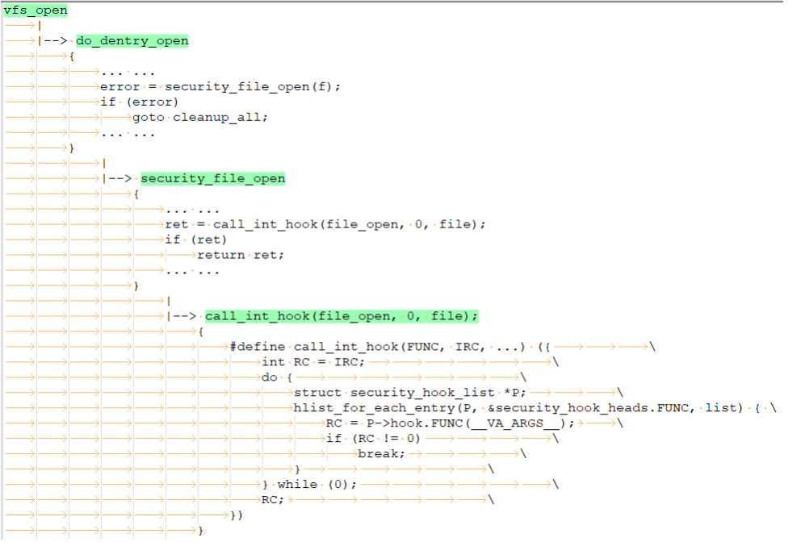
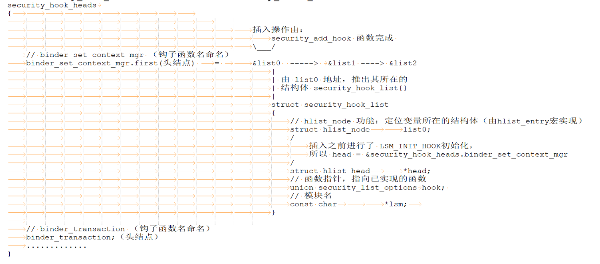

## Linux Security Modules 框架源码分析

### 一、前言

Linux Security Module (LSM)，是 Linux 下的一个安全框架标准，为不同的 Linux 安全模块提供统一标准接口，SElinux、Apparmor 等安全模块都是基于LSM框架。

### 二、LSM 原理概述

LSM 在被合入到 Linux 之前，当时的访问控制机制还不足以提供强大的安全性，存在的一些增强的访问控制机制，由于缺少安全社区的共识而没有被合入到 Linux 中。Linux 是通用操作系统，需要满足不同需求，访问控制机制同样需要满足不同的访问控制机制。在这样的背景下，LSM 因运而生，满足轻量级、通用性和可集成不同的访问控制机制等特点，被合入到 Linux 中。

**架构图**

------



LSM hook 会插入到访问 kernel 对象前面，DAC （自主访问控制）检查之后。然后 LSM 调用系统中启用的访问控制模块，检查是否可以访问 kernel 对象。若有多个访问控制模块，会根据初始化优先顺序执行，都允许访问才能进一步访问 kernel 对象。开发人员需要按照规范编写LSM模块，加载进内核，开展内核安全审计等动作。

**LSM 设计思想 & 涉及内核改动**

-----

LSM 为成功实现**强制访问控制模块**提供需要的结构和接口，同时对 Linux 内核进行尽可能少的更改。

- 关键内核数据结构中加入 安全域
- 内核中关键路径的函数内插入对安全钩子函数的调用
- 提供一个通用的安全系统调用
- 提供方法，允许内核模块注册为安全模块或者注销
- 将 capabilities 逻辑的大部分移植为一个可选的安全模块

LSM 设计者几乎罗列了任何可能出现问题的地方，然后在这些地方安插钩子，这些钩子的实现定义为回调函数，只需要去实现这些钩子函数即可达到访问控制的目的。
>
>安全域概念： 在进程、文件、inode 等许多重要数据结构都有自己的安全域，如：i_security。如：
>
>```c
>struct inode
>{
>	... ...
>  	#ifdef CONFIG_SECURITY
>    	void *i_security;
>  	#endif
>  	... ...
>}
>```
>
>安全 域是 LSM 的一种机制，允许 LSM 在内核对象上保存额外的安全相关信息， 并在整个对象生命周期内维护这些信息。在任务生命周期内，当需要对其进行访 问控制检查时，可以查看这个 安全域 来决定是否允许某项操作。安全域的实现 和 struct lsm_info 中的 blobs 相关。

### 三、核心数据结构

```c
union security_list_options {
	#define LSM_HOOK(RET, DEFAULT, NAME, ...) RET (*NAME)(__VA_ARGS__);
	#include "lsm_hook_defs.h"
	#undef LSM_HOOK
};

struct security_hook_heads {
	#define LSM_HOOK(RET, DEFAULT, NAME, ...) struct hlist_head NAME;
	#include "lsm_hook_defs.h"
	#undef LSM_HOOK
} __randomize_layout;

extern struct security_hook_heads security_hook_heads;
```

`lsm_hook_defs.h`文件罗列了所有 hook 的声明，使用 LSM_HOOK 宏对数据结构进行了定义:

```c
/*
 * The macro LSM_HOOK is used to define the data structures required by
 * the LSM framework using the pattern:
 *
 *	LSM_HOOK(<return_type>, <default_value>, <hook_name>, args...)
 *
 * struct security_hook_heads {
 *   #define LSM_HOOK(RET, DEFAULT, NAME, ...) struct hlist_head NAME;
 *   #include <linux/lsm_hook_defs.h>
 *   #undef LSM_HOOK
 * };
 */
... ...
LSM_HOOK(int, 0, binder_set_context_mgr, struct task_struct *mgr)
LSM_HOOK(int, 0, binder_transaction, struct task_struct *from,
	 struct task_struct *to)
... ...
```

综上，union security_list_options 和 struct security_hook_heads 的展开形式为：

```c
union security_list_options {
	... ...
    int (*binder_set_context_mgr)(const struct cred *mgr);
	int (*binder_transaction)(const struct cred *from, const struct cred *to);
    ... ...
};

struct security_hook_heads {
	... ...
    struct hlist_head binder_set_context_mgr;
	strcut hlist_head binder_transaction;
    ... ...
} __randomize_layout;
/* 
__randomize_layout 是一个特殊的属性，它指示内核在分配内存时对该全局变量进行随机化布局。
这有助于增加系统的安全性
*/
```


-----


每个访问控制模块都需要定义 security_hook_list 数组，security_hook_list 记录单个钩子函数的信息，然后调用 security_add_hooks 函数将 security_hook_list 数组所有成员尾插到以 security_hook_heads 的对应成员为链头 的链表上。

```c
/*
 * Security module hook list structure.
 * For use with generic list macros for common operations.
 */
struct security_hook_list {
    // 将该 hlist_node 尾插到 security_hook_heads.钩子函数名
	struct hlist_node		list;	
    // 指向 security_hook_heads.钩子函数名
	struct hlist_head		*head;  
    // 已经实现的钩子函数
	union security_list_options	hook;  
    // 模块名称
	char				*lsm; 
} __randomize_layout;
```

```c
static struct security_hook_list selinux_hooks[] __lsm_ro_after_init = {
    ... ...
    /*
    	binder_set_context_mgr: 钩子函数名，类型：函数指针
    	selinux_binder_set_context_mgr: 钩子函数的实现
    */
	LSM_HOOK_INIT(binder_set_context_mgr, selinux_binder_set_context_mgr),
	LSM_HOOK_INIT(binder_transaction, selinux_binder_transaction),
    ... ...
}

static __init int selinux_init(void)
{
    ... ...
    security_add_hooks(selinux_hooks, ARRAY_SIZE(selinux_hooks), "selinux");
    ... ...
}
```

security_hook_list 的赋值是通过 LSM_HOOK_INIT 宏，会初始化 head 和 hook 成员变量。这里的 .hook = { .HEAD = HOOK }; 因为 security_list_options 将各个钩子函数的声明组合成 union 结构，这样就可以用同一个类型标识所有钩子函数。

```c
#define LSM_HOOK_INIT(HEAD, HOOK) \
	{ .head = &security_hook_heads.HEAD, .hook = { .HEAD = HOOK } }

/*
举例：LSM_HOOK_INIT(binder_set_context_mgr, selinux_binder_set_context_mgr)

{
	.head = &security_hook_heads.binder_set_context_mgr：
	.hook = {.binder_set_context_mgr = selinux_binder_set_context_mgr}
}
*/
```

security_add _hooks 函数负责将 security_hook_list 数组添加到 security_hook_heads 成员头节点上。

```c
void __init security_add_hooks(struct security_hook_list *hooks, int count,
				char *lsm)
{
	int i;

	for (i = 0; i < count; i++) {
		hooks[i].lsm = lsm; // 模块名称
		// 将 &hooks[i].list 添加到 hooks[i].head 链表后
        // LSM_HOOK_INIT初始化之后，hooks[i].head = &security_hook_heads.HEAD
        // 此处为 将&hooks[i].list 添加到 security_hook_heads.HEAD 为链头的链表中
		hlist_add_tail_rcu(&hooks[i].list, hooks[i].head);
	}

	/*
	 * Don't try to append during early_security_init(), we'll come back
	 * and fix this up afterwards.
	 */
	if (slab_is_available()) {
		if (lsm_append(lsm, &lsm_names) < 0)
			panic("%s - Cannot get early memory.\n", __func__);
	}
}
```

经过 security_add_hooks 函数处理之后的 security_hook_heads 结构体变量效果如下：



通过 security_hook_heads 成员可以直接访问到安全模块注册的钩子函数。

-----

**LSM 调用链**


```c
/* 
FUNC 		指定要调用的钩子函数
IRC 		存储每个钩子的返回值
__VA_ARGS__ 是一个可变参数，用于在调用钩子时传递给它的参数
*/
#define call_int_hook(FUNC, IRC, ...) ({			\
	int RC = IRC;						\
	do {							\
		struct security_hook_list *P;			\
		// 此处可以具体看一下 hlist_for_each_entry，会有惊喜 \
		hlist_for_each_entry(P, &security_hook_heads.FUNC, list) { \
			// P->hook.FUNC(__VA_ARGS__) 调用指针函数的实现 \
			RC = P->hook.FUNC(__VA_ARGS__);		\
			if (RC != 0)				\
				break;				\
		}						\
	} while (0);						\
	RC;							\
})

```

-----

安全模块初始化相关的结构体为 struct lsm_info，lsm_info 描述每个安全模块信息。

```c
struct lsm_info {
   // 访问控制模块名字
	const char *name; 
	// 该模块在 LSM 顺序
	// LSM_ORDER_FIRST(目前capabilities使用，优先级高) 和 LSM_ORDER_MUTABLE(默认)
	enum lsm_order order; 
	/*
    	支持两种配置：
    		LSM_FLAG_LEGACY_MAJOR
    		LSM_FLAG_EXCLUSIVE:
    			标识为独占模块，如果有多个同类型模块只能使能一个，如 selinux,apparmor.. 只能采用一个
    */
	unsigned long flags; 
	int *enabled; 
	/*
		各个模块的初始化函数，通过调用该函数，初始化模块。
		如：landlock_add_cred_hooks 就是一个初始化函数
	*/
	int (*init)(void); 
	// 模块需要的私有数据大小
	struct lsm_blob_sizes *blobs; 
};
```

lsm_info 的初始化通过 DEFINE_LSM 和 DEFINE_EARLY_LSM 来定义， DEFINE_LSM 和 DEFINE_EARLY_LSM 会将 lsm_info 放置在对应的 section 上。

```c
/*
	## 用来连接字符串，将 lsm 参数与 __lsm_ 字符串连接起来，形成新的变量名
	__used：这是一个编译器指令，用于告诉编译器该结构体变量将被使用，避免出现未使用变量的警告。
	__section(".lsm_info.init")：这是一个编译器指令，用于将结构体变量放置在名为 .lsm_info.init 的段（section）中。
	__aligned(sizeof(unsigned long))：这是一个编译器指令，用于将结构体变量按照 unsigned long 的大小进行对齐
*/
#define DEFINE_LSM(lsm)							\
	static struct lsm_info __lsm_##lsm				\
		__used __section(".lsm_info.init")			\
		__aligned(sizeof(unsigned long))

#define DEFINE_EARLY_LSM(lsm)						\
	static struct lsm_info __early_lsm_##lsm			\
		__used __section(".early_lsm_info.init")		\
		__aligned(sizeof(unsigned long))


... ...
struct lsm_blob_sizes selinux_blob_sizes __lsm_ro_after_init = {
	.lbs_cred = sizeof(struct task_security_struct),
	.lbs_file = sizeof(struct file_security_struct),
	.lbs_inode = sizeof(struct inode_security_struct),
	.lbs_ipc = sizeof(struct ipc_security_struct),
	.lbs_msg_msg = sizeof(struct msg_security_struct),
};
... ...

... ...
/* SELinux requires early initialization in order to label
   all processes and objects when they are created. */
DEFINE_LSM(selinux) = {
        .name = "selinux",
        .flags = LSM_FLAG_LEGACY_MAJOR | LSM_FLAG_EXCLUSIVE,
        .enabled = &selinux_enabled_boot,
        .blobs = &selinux_blob_sizes,
        .init = selinux_init,
};
... ...
```

### 四、LSM 模块初始化

start_kenel (init\main.c) 是系统执行完架构相关代码后，通用的代码入口，LSM 初始化也是在这里调用。

```c
asmlinkage __visible void __init __no_sanitize_address start_kernel(void)
{
	... ...
	early_security_init(); //在5.4内核中，才增加了 early_lsm_init 部分
	... ...
    security_init();
    ... ...
}
```

增加 early_lsm_init 部分，方便允许对发生在 setup_arch() 中的东西施加策略，使系统具有在引导早期加载LSM策略的安全机制。调用early_lsm_init函数完成 early_lsm 阶段初始化。

```c
/*
extern struct lsm_info __start_lsm_info[] 和 extern struct lsm_info __end_lsm_info[] 
是用来获取 LSM（Linux Security Module）信息的符号。它们的具体功能是：

__start_lsm_info[]：
	这是一个数组符号，用于获取 LSM 信息的起始地址。
	它指向 .lsm_info.init 段中的第一个 LSM 结构体变量的地址。
	通过访问这个符号，可以获得 LSM 信息的起始位置。
	
__end_lsm_info[]：
	这是一个数组符号，用于获取 LSM 信息的结束地址。
	它指向 .lsm_info.init 段中的最后一个 LSM 结构体变量之后的地址。
	通过访问这个符号，可以获得 LSM 信息的结束位置。
	
	这些符号常用于内核初始化过程中，用于遍历和处理 LSM 的注册信息。
	通过迭代 __start_lsm_info 到 __end_lsm_info 之间的结构体变量，
	内核可以获取所有已注册的 LSM 的信息，并进行相应的初始化和管理操作。
需要注意的是，这些符号是外部声明的，意味着它们的定义通常在链接时由其他模块
或对象文件提供。它们允许内核和其他模块之间共享 LSM 信息，以便实现安全模块
的加载和运行时管理。
*/

extern struct lsm_info __start_lsm_info[], __end_lsm_info[];
extern struct lsm_info __start_early_lsm_info[], __end_early_lsm_info[];

int __init early_security_init(void)
{
	int i;
	
	struct hlist_head *list = (struct hlist_head *) &security_hook_heads;
	struct lsm_info *lsm;

	// 初始化每一个 hlist_head 结构体，hlist_head->first 链表头置 NULL
    // 相当于初始化 &security_hook_heads.NAME.first 链表头为 NULL 
	for (i = 0; i < sizeof(security_hook_heads) / sizeof(struct hlist_head);
	     i++)
		INIT_HLIST_HEAD(&list[i]);

	// __start_early_lsm_info 和 __end_early_lsm_info 之间是通过 DEFINE_EARLY_LSM 定义的 lsm_info，遍历这些 lsm_info
	for (lsm = __start_early_lsm_info; lsm < __end_early_lsm_info; lsm++) {
		// 如果该模块没有被启动，强制启用（启动阶段需要使能）
		if (!lsm->enabled)
			lsm->enabled = &lsm_enabled_true;
		// 对独占模块进行处理 和 lsm->blobs 初始化
		prepare_lsm(lsm);
		// 初始化安全模块
		initialize_lsm(lsm);
	}
	return 0;
}
```

在来看一下 prepare_lsm 和 initialize_lsm 函数的功能及实现

```c
/* Prepare LSM for initialization. */
static void __init prepare_lsm(struct lsm_info *lsm)
{
    /*
    	lsm_allowed() 里面会有多不判断，当lsm不启用或已经存在启用的独占模块，都标识为不启用
    */
	int enabled = lsm_allowed(lsm);

	/* Record enablement (to handle any following exclusive LSMs). */
    /*
		拦截一些不将被启用的独占模块，在 lsm_allowed(lsm) 中识别到独占 lsm 应该为 disabled
		使用 set_enabled 对 lsm 启动状态重新设置。
		如：安全模块 SELinux、AppArmor 和 Smack 中 SELinux 被选中初始化，其他模块将被抛弃，
		那么其他模块将被设置为 disabled 的状态
	*/
	set_enabled(lsm, enabled);

	/* If enabled, do pre-initialization work. */
	if (enabled) {
        /*
			lsm->flags & LSM_FLAG_EXCLUSIVE
				检查 lsm->flags 中是否设置了 LSM_FLAG_EXCLUSIVE 标志位。
				该标志位表示 LSM 模块是一个“独占”模块，只能选择其中一个进行初始化。
				
				如：常见的安全模块有 selinux, apparmor, smack 等，只能选择一个
				初始化确保模块的兼容性和功能的实现。
				
				系统中“lockdown,yama,loadpin,safesetid,integrity”和“capbility”
				均为非独占模块，在内核中可以作为必备模块加载。“selinux,apparmor,smack”
				均是独占模块，彼此排斥（即功能重复）
		*/
		if ((lsm->flags & LSM_FLAG_EXCLUSIVE) && !exclusive) {
            // 选择当前的 LSM 模块作为“独占”模块进行初始化
			exclusive = lsm;
			init_debug("exclusive chosen: %s\n", lsm->name);
		}
		// 初始化，计算 blob size
		lsm_set_blob_sizes(lsm->blobs);
	}
}
```

```c
/* Initialize a given LSM, if it is enabled. */
static void __init initialize_lsm(struct lsm_info *lsm)
{
	if (is_enabled(lsm)) {
		int ret;
		init_debug("initializing %s\n", lsm->name);
        // 调用注册的 init 函数，支持模块的初始化函数
		ret = lsm->init();
		WARN(ret, "%s failed to initialize: %d\n", lsm->name, ret);
	}
}
```

-----

其他非 early_lsm 模块，在 security_init 函数中初始化，初始化的模块是在系统运行时需要的部分

```c
int __init security_init(void)
{
	struct lsm_info *lsm;

	pr_info("Security Framework initializing\n");

	/*
	 * Append the names of the early LSM modules now that kmalloc() is
	 * available
	 */
	for (lsm = __start_early_lsm_info; lsm < __end_early_lsm_info; lsm++) {
		if (lsm->enabled)
			// lsm 启动状态为 ture，将 lsm->name 添加到 &lsm_names 字符串数组中，保存模块名
            // 在拷贝名字时 alloc 内存，因此在 early_security_init 中无法完成这个操作
			lsm_append(lsm->name, &lsm_names);
	}

	/* Load LSMs in specified order. */
	ordered_lsm_init();
	return 0;
}
```

```c
/* Ordered list of LSMs to initialize. */
/*
ordered_lsms：
	这是一个静态变量，用于存储已注册的 LSM 模块的指针列表。
	这个变量通常在内核初始化阶段使用，用于指示内核应按照指定顺序初始化 LSM 模块。
	
exclusive：
	这是一个静态变量，用于标记已注册的“独占”LSM模块。
	这个变量通常在内核初始化阶段使用，用于指示内核应该在初始化期间只加载一个特定的 LSM 模块。
	
两个变量都被修饰为 __initdata 类型，表示它们只在内核的初始化阶段使用，并且在初始化
完成后不再需要。它们通常用于 LSM 的初始化和管理，用于确定内核应该按照什么顺序初始化 
LSM 模块以及哪些模块只能选择其中一个进行初始化。

ordered_lsms 变量中存储的指针列表可以根据应用需求进行排序。内核可以依次遍历这个列表，
在每个 LSM 模块中执行必要的初始化操作。这个变量允许内核控制 LSM 初始化的顺序，以确保
依赖关系正确处理和功能正确实现。
==> 在 Linux 内核中，存在一些模块只能选择其中一个进行初始化的情况。如：
	安全模块 (Security Modules)：
		安全模块是 Linux 内核中用于实施安全策略和访问控制的模块。
		在内核启动时，只能选择一个安全模块进行初始化。
		常见的安全模块有 SELinux、AppArmor 和 Smack 等。
*/
static __initdata struct lsm_info **ordered_lsms;
static __initdata struct lsm_info *exclusive;

/*
chosen_lsm_order：
	用于存储用户在引导时选择的 LSM（Linux Security Modules） 的顺序。
	这个变量可能会被用来确定内核启动时加载哪个 LSM 模块。
	
chosen_major_lsm：
	用于存储用户在引导时选择的主要 LSM。这个变量可能会被用来确定内核启
	动时首选的主要 LSM 模块。
*/
static __initdata const char *chosen_lsm_order;
static __initdata const char *chosen_major_lsm;
/*
	CONFIG_LSM 是一个内核配置选项，它记录用户在编译内核时选择的 LSM 顺序。
	该选项可以在内核配置文件（通常是 config 或 defconfig）中设置
	
	默认顺序是“lockdown,yama,loadpin,safesetid,integrity,selinux,smack,tomoyo,apparmor,bpf”
	(没有列出capbility模块因为他是必备的)，参考《security/Kconfig: 278 config LSM》
*/
static __initconst const char *const builtin_lsm_order = CONFIG_LSM;

static void __init ordered_lsm_init(void)
{
	struct lsm_info **lsm;
	// ordered_lsms 类型为 lsm_info 的静态变量，用于指示内核应按照指定顺序初始化 LSM 模块
	ordered_lsms = kcalloc(LSM_COUNT + 1, sizeof(*ordered_lsms),
				GFP_KERNEL);
	/*
		在系统启动阶段可以对安全模块的顺序进行配置，cmdline配置如下：
		(security参数已被 lsm= 参数取代，因此已经被弃用)
		security=   [SECURITY] Choose a legacy "major" security module to
					enable at boot. This has been deprecated by the
					"lsm=" parameter.
			
		lsm=lsm1,...,lsmN
		            [SECURITY] Choose order of LSM initialization. This
		            overrides CONFIG_LSM, and the "security=" parameter.
		其中 CONFIG_LSM 在 deconfig 中已经配置好，是在用户不做配置情况下的默认行为
		
		通过使用 lsm= 参数，用户可以覆盖 CONFIG_LSM 配置选项的设置，以及使用 
		security= 参数指定的单个 LSM 模块
	*/
	// chosen_lsm_order 保存 lsm=lsm1,...,lsmN 模块顺序情况
	if (chosen_lsm_order) {
        // 在 lsm= 配置下，security= 被废弃
		if (chosen_major_lsm) {
			pr_info("security= is ignored because it is superseded by lsm=\n");
			chosen_major_lsm = NULL;
		}
        // 解析 LSM 模块的初始化顺序，并根据顺序去初始化或禁用 LSM 模块，取用户配置
		ordered_lsm_parse(chosen_lsm_order, "cmdline");
	} else
        // 解析 LSM 模块的初始化顺序，并根据顺序初始化和禁用 LSM 模块，针对默认配置
		ordered_lsm_parse(builtin_lsm_order, "builtin");
	// ordered_lsms 存放着所有已经排好序的 LSM 模块
	for (lsm = ordered_lsms; *lsm; lsm++)
		prepare_lsm(*lsm);

	init_debug("cred blob size     = %d\n", blob_sizes.lbs_cred);
	init_debug("file blob size     = %d\n", blob_sizes.lbs_file);
	init_debug("inode blob size    = %d\n", blob_sizes.lbs_inode);
	init_debug("ipc blob size      = %d\n", blob_sizes.lbs_ipc);
	init_debug("msg_msg blob size  = %d\n", blob_sizes.lbs_msg_msg);
	init_debug("task blob size     = %d\n", blob_sizes.lbs_task);

	/*
	 * Create any kmem_caches needed for blobs
	 */
	if (blob_sizes.lbs_file)
		lsm_file_cache = kmem_cache_create("lsm_file_cache",
						   blob_sizes.lbs_file, 0,
						   SLAB_PANIC, NULL);
	if (blob_sizes.lbs_inode)
		lsm_inode_cache = kmem_cache_create("lsm_inode_cache",
						    blob_sizes.lbs_inode, 0,
						    SLAB_PANIC, NULL);

	lsm_early_cred((struct cred *) current->cred);
	lsm_early_task(current);
	for (lsm = ordered_lsms; *lsm; lsm++)
		initialize_lsm(*lsm);

	kfree(ordered_lsms);
}
```

### 五、总结

LSM框架中的标准预置回调函数进行hook是当前安全加固最优雅的解决方案。

**参考：**

https://zhuanlan.zhihu.com/p/352103792

https://liwugang.github.io/2020/10/25/introduce_lsm.html

https://www.kernel.org/doc