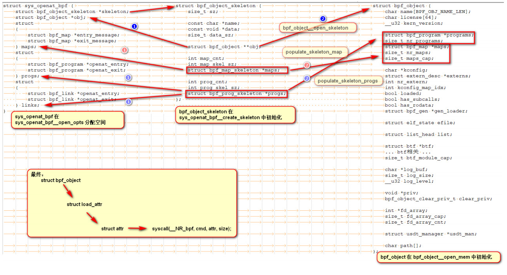

## EBPF 工作核心流程解析


## libbpf 核心结构体关系详解



## Libbpf API  解析 & demo

主要针对 `libbpf 0.8.1` 版本进行 `API` 说明

### 一、获取版本信息

```c
LIBBPF_API __u32 libbpf_major_version(void);
LIBBPF_API __u32 libbpf_minor_version(void);
LIBBPF_API const char *libbpf_version_string(void);
```

**功能：**
获取 `libbpf` 版本信息

**示例：**

```c
#include <stdio.h>
#include <bpf/libbpf.h>

int main()
{
    char res[100];

    uint32_t major = libbpf_major_version();
    uint32_t minor = libbpf_minor_version();
    const char *version = libbpf_version_string();
    
    sprintf(res, "%u-%u-%s", major, minor, version);
    printf("%s\n", res);
    return 0;
}
```

```shell
[root@wsip-70-182-147-69 Test]# ./get_version 
0-8-v0.8
```

### 二、`libbpf_strerror`

```c
/*
	@err : 错误类型
	@buf : 缓存错误信息
	@size: buflen 长度
*/
LIBBPF_API int libbpf_strerror(int err, char *buf, size_t size);
```

**功能：**
根据 `err` 错误码，识别错误类型，将错误信息存储在 `buf` 中。

**示例：**

```c
#include <stdio.h>
#include <malloc.h>
#include <bpf/libbpf.h>

int main()
{
    int size  = 20;
    char *buf = malloc(size * sizeof(char));
    /*
        1、小于 __LIBBPF_ERRNO__START 使用 strerror_r 标识错误
        2、__LIBBPF_ERRNO__START ~ __LIBBPF_ERRNO__END 之间标识为 libelf 错误
        3、其他为未知错误
    */
    uint32_t ErrCode = libbpf_strerror(LIBBPF_ERRNO__FORMAT, buf, size);
    printf("ErrCode %d: info %s\n", ErrCode, buf);
    return 0;
}
```

### 三、`libbpf_set_print`

```c
/**
 * @brief **libbpf_set_print()** sets user-provided log callback function to
 * be used for libbpf warnings and informational messages.
 * @param fn The log print function. If NULL, libbpf won't print anything.
 * @return Pointer to old print function.
 *
 * This function is thread-safe.
 */
LIBBPF_API libbpf_print_fn_t libbpf_set_print(libbpf_print_fn_t fn);
```

**功能：**
用户自定义`libbpf`运行时日志输出形式，在基于 `libbpf` 框架程序运行时输出相关的 `debug` 信息，用于问题定位。如：`ebpf elf` 解析、`ebpf map`加载、`ebpf prog` 加载等详细信息。

**示例：**

```c
#include <stdio.h>
#include <bpf/bpf.h>
#include <bpf/libbpf.h>

static int libbpf_print_fn(enum libbpf_print_level level,
				 const char *format, va_list ap) {
    return vfprintf(stderr, format, ap);
}

int main()
{
    libbpf_set_print(libbpf_print_fn);
    /*... 处理程序 ...*/ 
    return 0;
}
```

**原理：**

```c
static int __base_pr(enum libbpf_print_level level, const char *format,
		     va_list args)
{
	if (level == LIBBPF_DEBUG)
		return 0;

	return vfprintf(stderr, format, args);
}
/* 初始化 __libbpf_pr，定义 debug 信息输出 */
static libbpf_print_fn_t __libbpf_pr = __base_pr;

/*
	该函数的功能主要是将函数指针赋值给 __libbpf_pr 全局变量
*/
libbpf_print_fn_t libbpf_set_print(libbpf_print_fn_t fn)
{
	libbpf_print_fn_t old_print_fn = __libbpf_pr;
	/*：q
		__atomic_exchange_n 
			函数是 GCC 中的原子操作函数，用于将一个值与另一个值进行交换，并返回交换前的值。
			这个函数在多线程环境下使用非常方便，可以保证对变量的操作是原子性的。
	*/
	__libbpf_pr = fn;
	return old_print_fn;
}
/*
	libbpf_print 函数对 __libbpf_pr 进行分装，用以定义libbpf运行时 debug 信息输出。针对不同类型的日志信息，则是对 
	libbpf_print 更进一步的封装。
*/
__printf(2, 3)
void libbpf_print(enum libbpf_print_level level, const char *format, ...)
{
	va_list args;

	if (!__libbpf_pr)
		return;

	va_start(args, format);
	__libbpf_pr(level, format, args);
	va_end(args);
}
```

### 四、`bpf_object__open`

```c
LIBBPF_API struct bpf_object *bpf_object__open(const char *path);
```

**`bpf_object__open`函数调用栈：**

```c
// 初始化 struct bpf_object_open_attr 的 .file 和 .prog_type 变量
bpf_object__open
		|
		|	// 初始化 struct bpf_object_open_opts 的 .relaxed_maps 变量
		---> __bpf_object__open_xattr
				|
				|	// 解析 .o 文件，初始化 struct bpf_object 
				---> bpf_object_open 
```

**功能：**
根据 `ebpf` 字节码文件地址，获取并解析该文件，对 `struct bpf_object` 进行初始化

**示例：**

```c
#include <stdio.h>
#include <unistd.h>
#include <bpf/bpf.h>
#include <bpf/libbpf.h>

static int libbpf_print_fn(enum libbpf_print_level level, const char *format,
					 va_list args) {
    return vfprintf(stderr, format, args);
}

int main() {
    libbpf_set_print(libbpf_print_fn);

    char *path = "xdp_count.o";
    struct bpf_object *obj;
    // 打开 ebpf 对象文件
    obj = bpf_object__open(path);
    if (!obj) {
        fprintf(stderr, "open ebpf object file failed");
        return -1;
    }
	// 关闭 ebpf 对象
    bpf_object__close(obj);
    return 0;
}
```

### 五、`bpf_object__open_file`

```c
/**
 * @brief **bpf_object__open_file()** creates a bpf_object by opening
 * the BPF ELF object file pointed to by the passed path and loading it
 * into memory.
 * @param path BPF object file path
 * @param opts options for how to load the bpf object, this parameter is
 * optional and can be set to NULL
 * @return pointer to the new bpf_object; or NULL is returned on error,
 * error code is stored in errno
 */
LIBBPF_API struct bpf_object *
bpf_object__open_file(const char *path, const struct bpf_object_open_opts *opts);
```

**`bpf_object__open_file` 函数调用栈**

```c
bpf_object__open_file
	|
	|
	---> bpf_object_open
```

**功能：**
根据 `ebpf` 字节码文件地址，获取并解析该文件，对 `struct bpf_object` 进行初始化。并且可以通过 `struct bpf_object_open_opts` 指定加载 `bpf object` 的方式。

**示例：**

```c
#include <stdio.h>
#include <bpf/bpf.h>
#include <bpf/libbpf.h>

static int libbpf_print_fn(enum libbpf_print_level level, const char *format,
					 va_list args) {
    return vfprintf(stderr, format, args);
}

int main() {
    libbpf_set_print(libbpf_print_fn);

    char *path = "xdp_count.o";
    struct bpf_object *obj;
    obj = bpf_object__open_file(path, NULL);
    if (!obj) {
        fprintf(stderr, "open bpf object failed");
        return -1;
    }
	/*
		在用户态无法获取 struct bpf_object 的成员信息，对用户态隐藏了
		定义在 libbpf.h 头文件处：
			// Hide internal to user 
			struct bpf_object;
	*/
    bpf_object__close(obj);
    return 0;
}
```

### 六、将`BPF PROG`以多种 变体加载到内核

该特性在高版本中被弃用了，不过其思想我们还是可以了解一下，涉及的主要 `libbpf API`如下：

```c
/*LIBBPF_DEPRECATED_SINCE 是一个宏定义，用于标记某个函数或变量已经被弃用。*/
LIBBPF_DEPRECATED_SINCE(0, 7, "use bpf_program__insns() for getting bpf_program instructions")
LIBBPF_API int bpf_program__set_prep(struct bpf_program *prog, int nr_instance,
				     bpf_program_prep_t prep);

LIBBPF_DEPRECATED_SINCE(0, 7, "multi-instance bpf_program support is deprecated")
LIBBPF_API int bpf_program__nth_fd(const struct bpf_program *prog, int n);
```

**方案剖析：**


**参考：**
[patch] https://github.com/torvalds/linux/commit/
b580563e38487d9db8e94080149644da71c533c1

[patch mail] https://lore.kernel.org/all/1447675815-166222-8-git-send-email-wangnan0@huawei.com/T/#u

[demo] https://www.cs.rice.edu/~la5/doc/perf-doc/d6/d1e/bpf-loader_8c_source.html

### 七、`bpf_object__load` 

```c
LIBBPF_API int bpf_object__load(struct bpf_object *obj);
```

**功能：**
提取 `struct bpf_object` 中的相关信息，根据信息进行 `btf`  信息加载、`maps`创建、`prog`加载 等动作，最终将 `ebpf object` 信息传递到内核，内核根据传入信息进一步处理。

**示例：**

```c
#include <stdio.h>
#include <bpf/bpf.h>
#include <bpf/libbpf.h>

static int libbpf_print_fn(enum libbpf_print_level level, const char *format,
					 va_list args) {
    return vfprintf(stderr, format, args);
}

int main() {
    libbpf_set_print(libbpf_print_fn);

    int err;
    char *path = "xdp_count.o";
    struct bpf_object *obj;
    
    obj = bpf_object__open_file(path, NULL);
    if (libbpf_get_error(obj)) {
        fprintf(stderr, "Error loading BPF object from file: %s\n", path);
        return 1;
    }

    err = bpf_object__load(obj);
     if (err) {
        fprintf(stderr, "Error loading BPF object: %d\n", err);
        bpf_object__close(obj);
        return 1;
    }

    printf("BPF object loaded successfully\n");
    
    bpf_object__close(obj);
    return 0;
}
```

### 八、`pin map` 到指定路径

```c
/* pin_maps and unpin_maps can both be called with a NULL path, in which case
 * they will use the pin_path attribute of each map (and ignore all maps that
 * don't have a pin_path set).
 */
LIBBPF_API int bpf_object__pin_maps(struct bpf_object *obj, const char *path);
LIBBPF_API int bpf_object__unpin_maps(struct bpf_object *obj,
				      const char *path);
```

**`bpf_object_pin_maps` 函数调用栈**

```c
// 遍历 bpf_object 中的 map， 检视用户指定 pin 的 path
bpf_object__pin_maps
	|
	|	// 识别 map 是否重复绑定，识别 map 是否已经 pin 过了, 在校验无误后将 path 赋值给 map->pin_path
	--->  bpf_map__pin
			|
			|	// 根据 pin_path 创建目录
			--->  make_parent_dir
			|
			|	// 获取目录元数据信息，进行校验，如：f_type 是否为 BPF_FS_MAGIC
			--->  check_path
			|
			|	// 根据 fd 和 pathname 对 bpf_atttr 的 .pathname 和 .bpf_fd 进行赋值
			--->  bpf_obj_pin
					|
					|	// 进入系统调用阶段
					--->  sys_bpf(BPF_OBJ_PIN, &attr, sizeof(attr))
							|
							|
							---> syscall(__NR_bpf, cmd, attr, size)
```

**功能：**
根据用户指定的 `path` 去 `pin map`

**示例：**

```c
#include <stdio.h>
#include <unistd.h>
#include <bpf/bpf.h>
#include <bpf/libbpf.h>

static int libbpf_print_fn(enum libbpf_print_level level, const char *format,
					 va_list args) {
    return vfprintf(stderr, format, args);
}

int main() {
    libbpf_set_print(libbpf_print_fn);

    int err;
    char *path = "xdp_count.o";
    struct bpf_object *obj;
    // 解析 `ebpf elf`， 初始化 bpf_object  
    obj = bpf_object__open_file(path, NULL);
    if (libbpf_get_error(obj)) {
        fprintf(stderr, "Error loading BPF object from file: %s\n", path);
        return 1;
    }
	// 加载 bpf_object 相关信息到内核，如：加载 maps 到 kernel
    err = bpf_object__load(obj);
     if (err) {
        fprintf(stderr, "Error loading BPF object: %d\n", err);
        bpf_object__close(obj);
        return 1;
    }
	// 将 ebpf map pin 到指定的路径
    err = bpf_object__pin_maps(obj, "/sys/fs/bpf/map_fd");
    if (err) {
        fprintf(stderr, "Error pinning BPF maps: %d\n", err);
        bpf_object__close(obj);
        return 1;
    }

    sleep(10);

    err = bpf_object__unpin_maps(obj, "/sys/fs/bpf/map_fd");
    if (err) {
        fprintf(stderr, "Error unpinning BPF maps: %d\n", err);
        bpf_object__close(obj);
        return 1;
    }

    bpf_object__close(obj);
    return 0;
}
```

### 九、`pin prog` 到指定路径

```c
LIBBPF_API int bpf_object__pin_programs(struct bpf_object *obj,
					const char *path);
```

**`bpf_object__pin_programs`函数调用栈**

```c
// 遍历 struct bpf_object 中所有的 prog 进行处理
bpf_object__pin_programs
	|
	|	// 对 pin_path 路径校验，逐个遍历prog的instance进行处理
	---> bpf_program__pin
			|
			|	// 该处理部分可参考 第六节，针对单实例和多实例进行处理
			---> bpf_program_pin_instance
					|
					|	// 将每个 ebpf prog 的 fd pin 到指定的路径上
					---> bpf_obj_pin
							|
							|	// 根据 fd 和 pathname 对 union bpf_attr attr 成员初始化，动作类型 BPF_OBJ_PIN
							---> sys_bpf
									|
									|	// 触发系统调用
									---> syscall(__NR_bpf, cmd, attr, size)
```

**功能：**
`pin bpf prog` 到用户指定的 `BPF FS` 文件系统的文件。

**示例：**

```c
#include <stdio.h>
#include <unistd.h>
#include <bpf/bpf.h>
#include <bpf/libbpf.h>

static int libbpf_print_fn(enum libbpf_print_level level, const char *format,
					 va_list args) {
    return vfprintf(stderr, format, args);
}

int main() {
    libbpf_set_print(libbpf_print_fn);

    int err;
    const char *path = "xdp_count.o";
    const char *pin_path = "/sys/fs/bpf/progs";
    struct bpf_object *obj;
    
    obj = bpf_object__open_file(path, NULL);
    if (libbpf_get_error(obj)) {
        fprintf(stderr, "Error loading BPF object from file: %s\n", path);
        return 1;
    }

    err = bpf_object__load(obj);
     if (err) {
        fprintf(stderr, "Error loading BPF object: %d\n", err);
        bpf_object__close(obj);
        return 1;
    }

    err = bpf_object__pin_programs(obj, pin_path);
    if (err) {
        fprintf(stderr, "Error pinning BPF programs: %d\n", err);
        bpf_object__close(obj);
        return 1;
    }

    printf("BPF programs pinned at %s\n", pin_path);

    err = bpf_object__unpin_programs(obj, pin_path);
     if (err) {
        fprintf(stderr, "Error unpinning BPF programs: %d\n", err);
        bpf_object__close(obj);
        return 1;
    }

    bpf_object__close(obj);
    return 0;
}
```

https://github.com/torvalds/linux/commit/b580563e38487d9db8e94080149644da71c533c1

https://www.cs.rice.edu/~la5/doc/perf-doc/d6/d1e/bpf-loader_8c_source.html

### 十、 `pin object` 到指定路径

```c
LIBBPF_API int bpf_object__pin(struct bpf_object *object, const char *path);
```

 **功能：**

`bpf_object_pin` 函数是对 `bpf_object__pin_maps` 和 `bpf_object__pin_programs` 函数的封装，将 `maps、progs` `pin` 到指定的路径

**示例：**

```c
#include <stdio.h>
#include <unistd.h>
#include <bpf/bpf.h>
#include <bpf/libbpf.h>

static int libbpf_print_fn(enum libbpf_print_level level, const char *format,
					 va_list args) {
    return vfprintf(stderr, format, args);
}

int bpf_object__unpin(struct bpf_object *obj, const char *path)
{
	int err;
    char buf[128];

	err = bpf_object__unpin_programs(obj, path);
	if (err) {
        libbpf_strerror(err, buf, sizeof(buf));
        fprintf(stderr, "%s\n", buf);
        return err;
    }

	err = bpf_object__unpin_maps(obj, path);
    if (err) {
        libbpf_strerror(err, buf, sizeof(buf));
        fprintf(stderr, "%s\n", buf);
        return err;
    }

	return 0;
}

int main() {
    libbpf_set_print(libbpf_print_fn);

    int err;
    const char *path = "xdp_count.o";
    const char *pin_path = "/sys/fs/bpf/progs";
    struct bpf_object *obj;
    
    obj = bpf_object__open_file(path, NULL);
    if (libbpf_get_error(obj)) {
        fprintf(stderr, "Error loading BPF object from file: %s\n", path);
        return 1;
    }

    err = bpf_object__load(obj);
     if (err) {
        fprintf(stderr, "Error loading BPF object: %d\n", err);
        bpf_object__close(obj);
        return 1;
    }
	// pin ebpf object 到指定的路径上
    err = bpf_object__pin(obj, pin_path);
    if (err) {
        fprintf(stderr, "Error pinning BPF object: %d\n", err);
        bpf_object__close(obj);
        return 1;
    }

    printf("BPF object pinned at %s\n", pin_path);
	// 高版本 libbpf 中，支持 bpf_object__unpin API
    err = bpf_object__unpin(obj, pin_path);
     if (err) {
        fprintf(stderr, "Error unpinning BPF object: %d\n", err);
        bpf_object__close(obj);
        return 1;
    }

    bpf_object__close(obj);
    return 0;
}
```


### 十一、`bpf_object__name`

```c
LIBBPF_API const char *bpf_object__name(const struct bpf_object *obj);
```

**功能：**

获取 `ebpf object` 的名称

**示例：**

```c
#include <stdio.h>
#include <unistd.h>
#include <bpf/bpf.h>
#include <bpf/libbpf.h>

int main(int argc, char **argv)
{
    char *path = "xdp_count.o";
    struct bpf_object *obj;

    obj = bpf_object__open_file(path, NULL);
    if (libbpf_get_error(obj))
    {
        fprintf(stderr, "bpf object open failed: %s\n", path);
        return -1;
    }
	// 获取 object 对象名
    const char *obj_name = bpf_object__name(obj);
    printf("object name: %s\n", obj_name);

    bpf_object__close(obj);
    return 0;
}
```

### 十二、`bpf_object__kversion`

```c
LIBBPF_API unsigned int bpf_object__kversion(const struct bpf_object *obj);
```

**功能：**

获取系统当前的 `kernel` 版本信息

**示例：**

```c
#include <stdio.h>
#include <unistd.h>
#include <bpf/bpf.h>
#include <bpf/libbpf.h>

void print_kernel_version(unsigned int kern_version)
{
    // 内核版本号的格式通常是：主版本号 << 16 | 次版本号 << 8 | 修订号
    // 使用位操作提取出主版本号、次版本号和修订号
    unsigned int major = (kern_version >> 16) & 0xFF;
    unsigned int minor = (kern_version >> 8) & 0xFF;
    unsigned int patch = kern_version & 0xFF;

    printf("Kernel Version: %u.%u.%u\n", major, minor, patch);
}

int main(int argc, char **argv)
{
    char *path = "xdp_count.o";
    struct bpf_object *obj;

    obj = bpf_object__open_file(path, NULL);
    if (libbpf_get_error(obj))
    {
        fprintf(stderr, "bpf object open failed: %s\n", path);
        return -1;
    }

    unsigned int obj_kv = bpf_object__kversion(obj);
    print_kernel_version(obj_kv);

    bpf_object__close(obj);
    return 0;
}
```

### 十三、`bpf_object__set_kversion`

```c
LIBBPF_API int bpf_object__set_kversion(struct bpf_object *obj, __u32 kern_version);
```

**功能：**

设置 `struct bpf_object` 中的 `kern_version`

**示例：**

```c
#include <stdio.h>
#include <unistd.h>
#include <bpf/bpf.h>
#include <bpf/libbpf.h>

void print_kernel_version(unsigned int kern_version)
{
    // 内核版本号的格式通常是：主版本号 << 16 | 次版本号 << 8 | 修订号
    // 使用位操作提取出主版本号、次版本号和修订号
    unsigned int major = (kern_version >> 16) & 0xFF;
    unsigned int minor = (kern_version >> 8) & 0xFF;
    unsigned int patch = kern_version & 0xFF;

    printf("Kernel Version: %u.%u.%u\n", major, minor, patch);
}

int main(int argc, char **argv)
{
    int err;
    char *path = "xdp_count.o";
    struct bpf_object *obj;

    obj = bpf_object__open_file(path, NULL);
    if (libbpf_get_error(obj))
    {
        fprintf(stderr, "bpf object open failed: %s\n", path);
        return -1;
    }

    err = bpf_object__set_kversion(obj, 394496);
    if (err)
    {
        fprintf(stderr, "bpf object set kversion failed\n");
        return -1;
    }
    unsigned int obj_kv = bpf_object__kversion(obj);
    print_kernel_version(obj_kv);

    bpf_object__close(obj);
    return 0;
}
```

### 十四、`bpf_object__btf`

```c
struct btf;
LIBBPF_API struct btf *bpf_object__btf(const struct bpf_object *obj);
```

**功能：**

获取 `struct bpf_object` 的 `struct btf` 信息

**示例：**

```c
#include <stdio.h>
#include <unistd.h>
#include <bpf/btf.h>
#include <bpf/bpf.h>
#include <bpf/libbpf.h>

int main(int argc, char **argv)
{
    int err;
    char *path = "xdp_count.o";
    struct bpf_object *obj;

    obj = bpf_object__open_file(path, NULL);
    if (libbpf_get_error(obj))
    {
        fprintf(stderr, "bpf object open failed: %s\n", path);
        return -1;
    }
    /*
        struct btf 对用户侧隐藏，无法直接获取结构体内部数据
    */
    struct btf *btf_info = bpf_object__btf(obj);
    if (libbpf_get_error(btf_info))
    {
        fprintf(stderr, "bpf object btf fetch failed\n");
        return -1;
    }

    // 获取 BTF 类型数量
    int type_count = btf__type_cnt(btf_info);
    printf("Number of BTF types: %d\n", type_count);

    bpf_object__close(obj);
    return 0;
}
```

### 十五、`bpf_object__btf_fd`

```c
LIBBPF_API int bpf_object__btf_fd(const struct bpf_object *obj);
```

**功能：**

`btf` 对象加载到`kernel`之后，从 `struct bpf_object` 中获取`struct btf` 的 `fd` 信息

**示例：**

```c
#include <stdio.h>
#include <unistd.h>
#include <bpf/btf.h>
#include <bpf/bpf.h>
#include <bpf/libbpf.h>

int main(int argc, char **argv)
{
    int err;
    int btf_fd;
    char *path = "xdp_count.o";
    struct bpf_object *obj;

    obj = bpf_object__open_file(path, NULL);
    if (libbpf_get_error(obj))
    {
        fprintf(stderr, "bpf object open failed: %s\n", path);
        return -1;
    }
    
    err = bpf_object__load(obj);
    if (err) {
        fprintf(stderr, "bpf object load failed \n");
        return err;
    }
	// 获取 btf 文件描述符
    btf_fd = bpf_object__btf_fd(obj);
    if (btf_fd < 0) {
        fprintf(stderr, "No BTF file descriptor available for the BPF object\n");
        bpf_object__close(obj);
        return 1;
    }

    printf("BTF file descriptor: %d\n", btf_fd);

    bpf_object__close(obj);
    return 0;
}
```

### 十六、`bpf_object__find_program_by_name`

```c
LIBBPF_API struct bpf_program *
bpf_object__find_program_by_name(const struct bpf_object *obj, const char *name);
```

**功能：**

根据 `ebpf prog name` 在 `struct bpf_object`中遍历 `progs` 获取对应的 `bpf_program`。在进行匹配时，需要对当前 `prog` 是否为子程序校验。

**代码分析**

```c
static bool prog_is_subprog(const struct bpf_object *obj, const struct bpf_program *prog)
{
	// 如果 prog 中的节索引 等于 obj 中 ELF 文件的 .text 节索引，且 obj 中programs数量大于1， 则表明该 prog  是子程序
	return prog->sec_idx == obj->efile.text_shndx && obj->nr_programs > 1;
}

struct bpf_program *
bpf_object__find_program_by_name(const struct bpf_object *obj,
				 const char *name)
{
	struct bpf_program *prog;

	bpf_object__for_each_program(prog, obj) {
		if (prog_is_subprog(obj, prog))
			continue;
		if (!strcmp(prog->name, name))
			return prog;
	}
	return errno = ENOENT, NULL;
}
```

**示例：**

```c

```

### 十七、`Ring buffer APIS`

```c
/* Ring buffer APIs */
struct ring_buffer;

typedef int (*ring_buffer_sample_fn)(void *ctx, void *data, size_t size);

struct ring_buffer_opts {
	size_t sz; /* size of this struct, for forward/backward compatiblity */
};

#define ring_buffer_opts__last_field sz

LIBBPF_API struct ring_buffer *
ring_buffer__new(int map_fd, ring_buffer_sample_fn sample_cb, void *ctx,
		 const struct ring_buffer_opts *opts);
LIBBPF_API void ring_buffer__free(struct ring_buffer *rb);
LIBBPF_API int ring_buffer__add(struct ring_buffer *rb, int map_fd,
				ring_buffer_sample_fn sample_cb, void *ctx);
LIBBPF_API int ring_buffer__poll(struct ring_buffer *rb, int timeout_ms);
LIBBPF_API int ring_buffer__consume(struct ring_buffer *rb);
LIBBPF_API int ring_buffer__epoll_fd(const struct ring_buffer *rb);
```

**1、**

### 参考

【`ebpf` 汇编语法 - 简介版】 https://github.com/iovisor/bpf-docs/blob/master/eBPF.md

【`ebpf` 汇编语法 - 详尽版】 https://www.kernel.org/doc/Documentation/networking/filter.txt